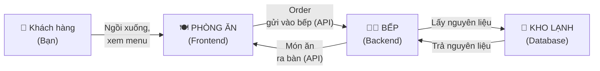
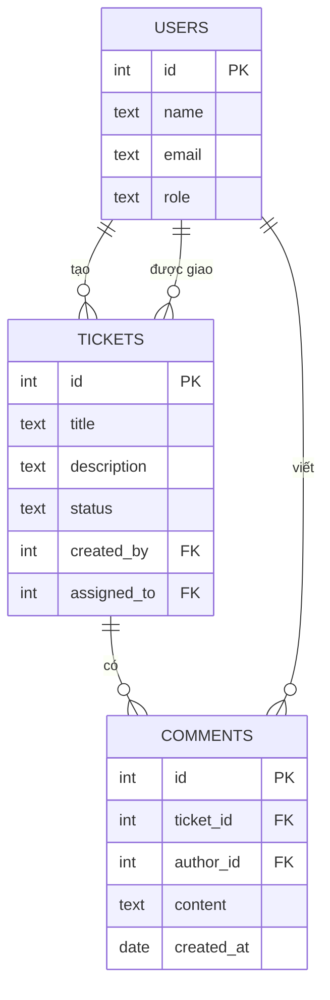
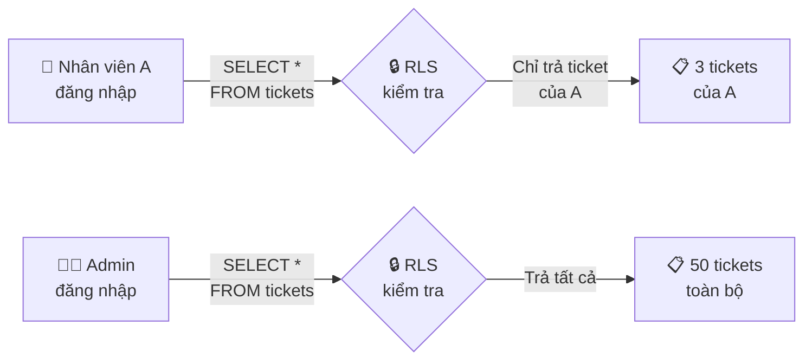
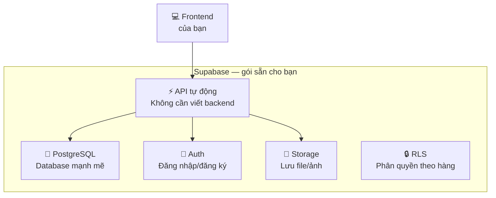
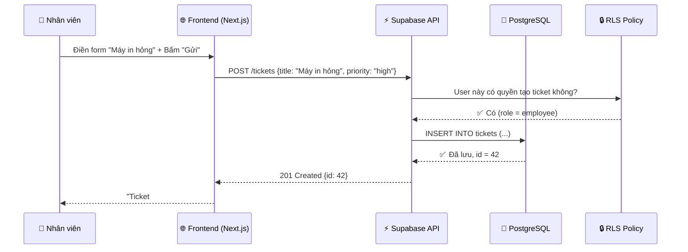

> ⏱️ **Thời lượng đọc:** ~45 phút
> 🎯 **Mục tiêu:** Hiểu sâu hơn về 3 tầng của ứng dụng web (Frontend / Backend / Database), biết API là gì, RLS hoạt động ra sao, và Supabase giúp bạn điều gì.

---

## 1. Ôn Lại: Ba Tầng Của Mọi Ứng Dụng Web

Ở [bài 01](./01-what-is-code.md), bạn đã biết ví von nhà hàng. Giờ mình đi sâu hơn vào từng tầng.



---

## 2. Frontend là gì?

Frontend là phần người dùng nhìn thấy và tương tác.

Các thành phần cơ bản:

- **HTML:** cấu trúc nội dung, như form, tiêu đề, bảng.
- **CSS:** cách trình bày, màu sắc, khoảng cách, responsive.
- **JavaScript:** hành vi tương tác, ví dụ bấm nút, lọc danh sách, gọi API.

Trong khóa này, bạn có thể gặp React/Next.js. Hãy hiểu đơn giản: React giúp chia giao diện thành các component nhỏ, còn Next.js giúp tổ chức route, render trang và deploy dễ hơn.

### HTML — Cấu trúc (bộ xương)

HTML quyết định **có gì** trên trang: tiêu đề, đoạn văn, hình ảnh, nút bấm, form nhập liệu.

```
Ví von: HTML giống như bản thiết kế kiến trúc —
"Ở đây có 1 phòng khách, 2 phòng ngủ, 1 nhà bếp."
Chưa nói gì về màu sơn hay nội thất.
```

Ví dụ HTML đơn giản (bạn không cần nhớ, chỉ cần nhận diện):

```html
<h1>Đặt phòng họp</h1>
<p>Chọn phòng và giờ bạn muốn đặt.</p>
<button>Đặt ngay</button>
```

→ Trình duyệt hiểu: "À, có 1 tiêu đề, 1 đoạn text, 1 nút bấm."

### CSS — Trang trí (da + quần áo)

CSS quyết định **trông như thế nào**: màu sắc, font chữ, kích thước, khoảng cách, hiệu ứng.

```
Ví von: CSS giống như nhà thiết kế nội thất —
"Phòng khách sơn trắng, ghế sofa xám, đèn vàng ấm."
```

### JavaScript (JS) — Hành vi (hệ thống điện)

JS quyết định **phản ứng thế nào** khi người dùng tương tác: click nút → mở popup, nhập form → kiểm tra email đúng chưa, kéo thả → đổi vị trí.

```
Ví von: JS giống hệ thống điện + cơ khí —
"Bấm công tắc → đèn sáng. Mở cửa → chuông reo."
```

### Bộ ba gộp lại

| | HTML | CSS | JS |
|---|---|---|---|
| **Vai trò** | Cấu trúc | Trang trí | Tương tác |
| **Ví von** | Bộ xương | Da + quần áo | Cơ bắp + thần kinh |
| **Thiếu thì sao?** | Không có trang | Trang trắng xấu | Trang "chết" — bấm không phản hồi |
| **AI viết cho bạn?** | ✅ Có | ✅ Có | ✅ Có |

> 💡 **Tin vui:** Trong Vibe Coding, AI viết cả 3 cho bạn. Bạn chỉ cần **mô tả bạn muốn gì**.

---

## 3. Backend là gì?

Backend xử lý logic mà frontend không nên tự làm:

- Kiểm tra quyền người dùng.
- Kiểm tra dữ liệu hợp lệ.
- Ghi/đọc database.
- Gửi email.
- Tính báo cáo.
- Bảo vệ secret key.

Ví dụ **ExpenseFlow** không thể để frontend tự quyết "đề xuất này đã được kế toán duyệt", vì người dùng có thể sửa request trong trình duyệt. Backend phải kiểm tra role và trạng thái hiện tại.

---

## 4. API — Người Bồi Bàn Giữa Frontend Và Backend

### API là gì?

**API (Application Programming Interface)** = bộ quy tắc để Frontend "nói chuyện" với Backend.

```
Ví von: Bạn (frontend) ngồi ở bàn nhà hàng. Bạn KHÔNG tự chạy vào bếp.
Bạn gọi người bồi bàn (API), nói "Cho tôi 1 phở bò tái."
Bồi bàn mang order vào bếp (backend), bếp nấu xong, bồi bàn mang ra.
```

### REST — "Ngôn ngữ" phổ biến nhất của API

REST dùng 4 hành động chính:

| Hành động | Nghĩa | Ví dụ nhà hàng | Ví dụ ứng dụng |
|-----------|-------|----------------|----------------|
| **GET** | Xem / lấy dữ liệu | "Cho xem menu" | Xem danh sách ticket |
| **POST** | Tạo mới | "Gọi 1 phở bò" | Tạo ticket mới |
| **PUT** | Sửa / cập nhật | "Đổi phở bò thành phở gà" | Cập nhật trạng thái ticket |
| **DELETE** | Xoá | "Huỷ phở bò" | Xoá ticket nháp |

### Status code — "Bồi bàn phản hồi"

Sau mỗi request, server trả về 1 **mã số** cho biết kết quả:

| Mã | Nghĩa | Ví von |
|----|-------|--------|
| **200** | OK — thành công | "Đây, phở của bạn!" |
| **201** | Created — tạo mới thành công | "Order đã ghi nhận!" |
| **400** | Bad Request — sai cú pháp | "Dạ em không hiểu order" |
| **401** | Unauthorized — chưa đăng nhập | "Quý khách chưa có vé vào cửa" |
| **404** | Not Found — không tìm thấy | "Dạ quán không có món này" |
| **500** | Server Error — lỗi bếp | "Bếp bị cháy, xin lỗi quý khách!" |

> 💡 **Bạn không cần nhớ hết mã** — chỉ cần biết: 2xx = tốt, 4xx = lỗi do bạn, 5xx = lỗi do server.

---

## 5. Database Sâu Hơn — Bảng, Quan Hệ, Khoá Ngoại

### Database = nhiều bảng liên kết

Ở [bài 01](./01-what-is-code.md) bạn biết database giống Excel. Nhưng 1 app thật có **nhiều bảng**, và chúng **liên kết** với nhau.

**Ví dụ: HelpDesk Mini** (đồ án giảng viên demo)



**Đọc sơ đồ này:**
- 1 User **tạo** nhiều Ticket (1 → nhiều)
- 1 Ticket **có** nhiều Comment (1 → nhiều)
- Mỗi Comment **thuộc về** 1 User và 1 Ticket

### Khoá ngoại (Foreign Key) — sợi dây liên kết

**Khoá ngoại (FK)** là cột trong bảng A chỉ đến dòng trong bảng B.

```
Bảng TICKETS có cột "created_by" = id của user nào tạo ticket.
→ Đó là khoá ngoại — nó "trỏ" sang bảng USERS.
```

Ví von: **Khoá ngoại giống "số phòng" trên thẻ khách sạn** — nhìn vào biết khách ở phòng nào.

---

## 6. RLS — Row Level Security

### Vấn đề

Bạn có bảng `employees` chứa lương của toàn công ty. **Ai cũng query được bảng này** → lộ lương hết!

### Giải pháp: RLS

**RLS (Row Level Security)** = quy tắc "mỗi người chỉ thấy dòng liên quan đến mình."

```
Ví von: Tủ hồ sơ văn phòng.
- Nhân viên mở tủ → chỉ thấy hồ sơ của mình (ngăn kéo khoá).
- Trưởng phòng → thấy hồ sơ cả phòng mình.
- Giám đốc → thấy tất cả.
```



**Cùng 1 câu hỏi** ("cho xem tất cả ticket"), **kết quả khác nhau** tuỳ người hỏi là ai. Đó là sức mạnh của RLS.

> 💡 **Trong khoá học:** Khi build schema ở buổi 3, bạn sẽ viết RLS policy để bảo vệ dữ liệu. AI sẽ giúp bạn viết, nhưng bạn cần hiểu "mỗi vai trò thấy gì."

---

## 7. Supabase — "Backend Gói Sẵn" Cho Bạn

### Vấn đề

Xây backend từ đầu cần: cài database, viết API, thiết lập đăng nhập, lưu file... Rất nhiều việc, đặc biệt cho người mới.

### Giải pháp: Supabase

**Supabase** gói sẵn tất cả vào 1 nền tảng miễn phí:



| Supabase cung cấp | Bạn phải làm | AI giúp bạn |
|-------------------|-------------|-------------|
| Database (PostgreSQL) | Thiết kế bảng (schema) | ✅ Viết SQL tạo bảng |
| Auth (đăng nhập) | Chọn phương thức (Magic Link / Google) | ✅ Cài đặt |
| Storage (lưu file) | Quyết định lưu gì (CV, ảnh hoá đơn) | ✅ Config |
| API tự động | Không cần viết! | — |
| RLS | Định nghĩa "ai thấy gì" | ✅ Viết policy |

### Free tier — đủ dùng cho khoá học

| Tài nguyên | Giới hạn miễn phí |
|------------|-------------------|
| Database | 500 MB |
| Storage | 1 GB |
| Auth users | 50.000 MAU |
| API requests | Không giới hạn |
| Bandwidth | 5 GB |

→ **Dư sức** cho đồ án cuối khoá với 5–20 user nội bộ.

---

## 7. Tất Cả Gộp Lại — Luồng Đi Cụ Thể

Ví dụ: **Nhân viên tạo ticket trên HelpDesk Mini**



---

## 8. Bảng Tóm Tắt Thuật Ngữ

| Thuật ngữ | Nghĩa | Một câu nhớ nhanh |
|-----------|-------|--------------------|
| **Frontend** | Phần người dùng nhìn thấy | "Phòng ăn nhà hàng" |
| **Backend** | Phần xử lý logic phía sau | "Nhà bếp" |
| **Database** | Nơi lưu trữ dữ liệu | "Kho lạnh , tủ hồ sơ" |
| **API** | Cầu nối giữa FE và BE | "Người bồi bàn" |
| **REST** | Quy tắc API phổ biến | "GET = xem, POST = tạo, PUT = sửa, DELETE = xoá" |
| **RLS** | Phân quyền theo dòng dữ liệu | "Ai thấy dòng nào tuỳ vai trò" |
| **Supabase** | Nền tảng backend gói sẵn | "Backend-as-a-Service miễn phí" |
| **Foreign Key** | Cột liên kết giữa 2 bảng | "Số phòng trên thẻ khách sạn" |

---

## ✅ Bạn Đã Hiểu Chưa?

1. **HTML, CSS, JS mỗi cái làm gì?** Dùng ví von bộ xương / da / cơ bắp.
2. **API là gì?** Giải thích bằng ví von người bồi bàn.
3. **GET và POST khác nhau ra sao?** Cho 1 ví dụ thực tế.
4. **RLS giải quyết vấn đề gì?** Vì sao quan trọng?
5. **Supabase giúp bạn bỏ qua bước nào** khi xây ứng dụng?

> 🎯 Trả lời được 5/5 → bạn sẵn sàng cho phần schema ở buổi 3!

---

*📖 Đọc tiếp: [04 — Agile & Scrum Cho Người Mới](./04-agile-scrum-101.md)*
