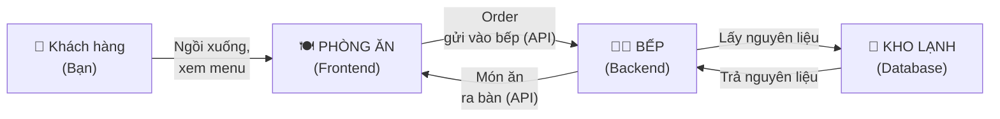
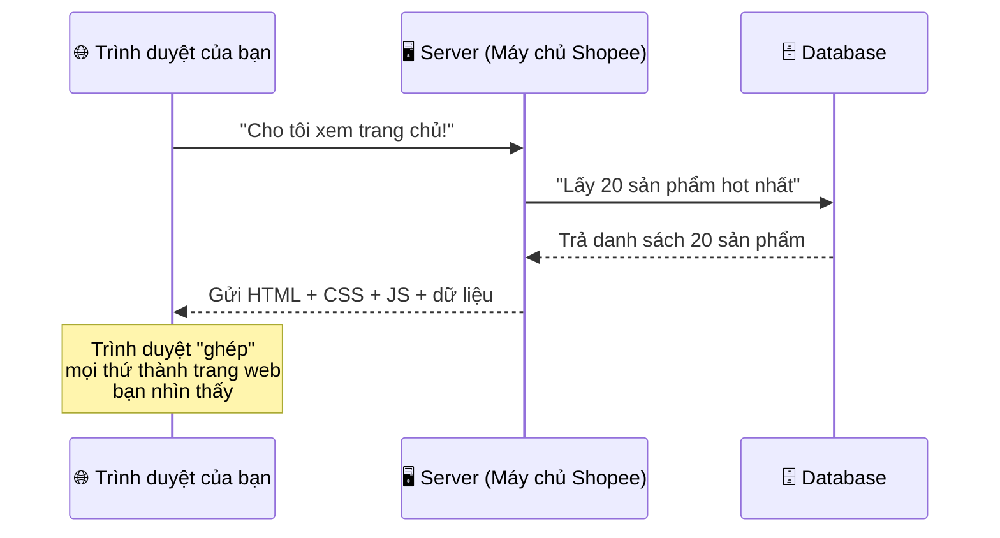
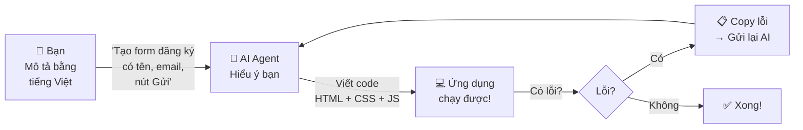
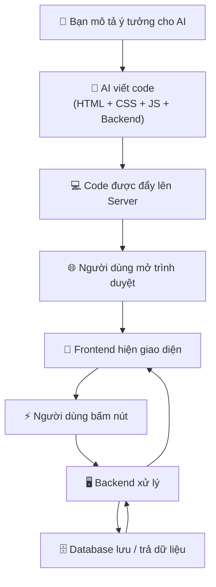

> ⏱️ **Thời lượng:**   
> 🎯 **Mục tiêu:**   


## 1. Code — Bộ Công Thức Nấu Ăn Cho Máy Tính

Hãy tưởng tượng bạn đang dạy một đầu bếp robot nấu phở.

Robot này **rất giỏi** làm theo hướng dẫn, nhưng **không tự nghĩ** được. Bạn phải viết ra **từng bước cụ thể**:

```
1. Đổ 2 lít nước vào nồi.
2. Bật lửa vừa.
3. Khi nước sôi → thả xương bò vào.
4. Hầm 3 tiếng.
5. Nếu nước cạn dưới 1 lít → thêm nước.
```

**Code chính là "bộ công thức" như vậy** — nhưng thay vì nấu ăn, bạn đang hướng dẫn máy tính:

- Hiển thị nút bấm trên màn hình
- Lưu thông tin người dùng nhập vào
- Gửi email thông báo khi có đơn hàng mới

> 💡 **Key insight:** Code không phải phép thuật. Nó chỉ là **danh sách hướng dẫn** viết bằng ngôn ngữ máy tính hiểu được.

---

## 2. Frontend & Backend — Nhà Hàng Có Hai Nửa

Khi bạn dùng bất kỳ ứng dụng web nào (Facebook, Shopee, Gmail...), phía sau nó luôn có **hai phần**:

### Ví von: Nhà hàng



| Phần | Ví von | Trong ứng dụng thật |
|------|--------|---------------------|
| **Frontend** | Phòng ăn — nơi khách nhìn thấy, tương tác | Giao diện bạn nhìn thấy: nút bấm, form nhập, hình ảnh |
| **Backend** | Nhà bếp — nơi chế biến, khách không thấy | Xử lý logic: tính toán, kiểm tra quyền, gửi email |
| **Database** | Kho lạnh — nơi lưu trữ nguyên liệu | Lưu dữ liệu: tên khách, đơn hàng, lịch sử |
| **API** | Phiếu gọi món - yêu cầu (request), món ăn ra bàn - phục vụ món (response) | Cách frontend nói chuyện với backend |

### Vì sao phải tách hai phần?

- **Bảo mật:** Bạn không muốn khách hàng vào bếp lục nồi — tương tự, người dùng không được trực tiếp sờ vào database.
- **Phân công:** Đầu bếp tập trung nấu, phục vụ tập trung bưng bê — mỗi phần làm tốt việc của mình.
- **Linh hoạt:** Đổi menu (frontend) mà không cần phá bếp (backend).

> Người dùng không cần thấy "bếp", nhưng nếu bếp xử lý sai thì món ra sai. App cũng vậy: giao diện đẹp không cứu được logic sai.

---

## 3. Database — Tủ Hồ Sơ Siêu Tổ Chức

Database (cơ sở dữ liệu) nghe phức tạp, nhưng bản chất nó giống **một bảng Excel khổng lồ, có tổ chức.**

| id | tên_khách | email | ngày_đặt | tổng_tiền |
|----|-----------|-------|----------|-----------|
| 1 | Lan | lan@email.com | 2026-01-15 | 250.000đ |
| 2 | Minh | minh@email.com | 2026-01-16 | 180.000đ |
| 3 | Hoa | hoa@email.com | 2026-01-16 | 320.000đ |

**Khác Excel ở chỗ nào?**

| Excel | Database |
|-------|----------|
| 1 người mở file → khoá người khác | Nhiều người truy cập cùng lúc |
| Ai mở cũng xem/sửa được hết | Phân quyền: ai được xem gì, sửa gì |
| File nặng → treo | Xử lý triệu dòng vẫn nhanh |
| Không có lịch sử thay đổi | Ghi log: ai sửa gì, lúc nào |

> 💡 **Key insight:** Database giống "bản Excel siêu cấp" — nhanh hơn, an toàn hơn, nhiều người dùng được cùng lúc.

---

## 4. File, folder, project

Một project phần mềm là một thư mục gồm nhiều file. Mỗi file thường có trách nhiệm riêng:

```text
my-app/
├── app/
│   ├── page.tsx          # màn hình chính
│   └── dashboard/page.tsx
├── components/
│   └── Button.tsx        # nút dùng lại nhiều nơi
├── lib/
│   └── database.ts       # kết nối database
└── README.md             # hướng dẫn project
```

Bạn không cần nhớ cú pháp ngay từ đầu. Việc quan trọng hơn là biết file nào phục vụ việc gì để khi AI sửa nhầm, bạn nhận ra được.

---

## 5. Trình Duyệt Đọc Code Như Thế Nào?

Khi bạn gõ `shopee.vn` vào trình duyệt, chuyện gì xảy ra?



**Ba ngôn ngữ trình duyệt hiểu:**

| Ngôn ngữ | Vai trò | Ví von |
|----------|---------|--------|
| **HTML** | Cấu trúc trang | Bộ khung nhà — tường, cửa, phòng |
| **CSS** | Trang trí | Sơn tường, trải thảm, treo đèn |
| **JavaScript** | Hành vi tương tác | Hệ thống điện — bật đèn, mở cửa tự động |

Bạn không cần nhớ ba cái này chi tiết — chỉ cần biết **chúng luôn đi cùng nhau** để tạo ra trang web.

---

## 6. Bug là gì?

Bug là khi chương trình chạy khác với mong đợi.

Bug có nhiều kiểu:

- **Syntax error:** code viết sai cú pháp, app không chạy.
- **Logic error:** app chạy nhưng kết quả sai.
- **Data error:** dữ liệu thiếu, trùng, sai định dạng.
- **Permission error:** người không có quyền xem/sửa dữ liệu.
- **Edge case:** tình huống hiếm nhưng có thật, ví dụ nhập emoji vào số điện thoại.

Trong khóa này, bạn sẽ học cách "ném lỗi" cho AI: copy log, mô tả hành động gây lỗi, yêu cầu AI sửa trong phạm vi ngữ cảnh hiện tại.

---

## 7. Vibe Coding — Bạn Mô Tả, AI Viết Code

Truyền thống, muốn xây ứng dụng, bạn phải **tự gõ code** — giống tự tay viết công thức nấu ăn bằng tiếng Nhật mà bạn chưa biết tiếng Nhật.

**Vibe Coding** thay đổi cuộc chơi:



| Code truyền thống | Vibe Coding |
|-------------------|-------------|
| Bạn viết code | AI viết code, bạn dẫn dắt |
| Cần biết cú pháp ngôn ngữ lập trình | Cần biết **mô tả rõ** cái bạn muốn |
| Debug = đọc code tìm lỗi | Debug = copy lỗi, ném cho AI sửa |
| Học 6–12 tháng mới tạo được app | Tạo app đầu tiên trong **1 ngày** |

> 💡 **Key insight:** Vibe Coding không loại bỏ code — nó loại bỏ việc **bạn phải tự viết code**. Bộ kỹ năng quan trọng nhất là:
>
> 1. **Mô tả chính xác** vấn đề cần giải quyết.
> 2. **Chia nhỏ việc** đủ rõ để AI làm từng miếng.
> 3. **Kiểm tra output** của AI bằng tiêu chí cụ thể.  

> AI giống một thực tập sinh rất nhanh: làm được nhiều, nhưng cần brief rõ, review kỹ và không được giao mơ hồ.

---

## 8. Tất Cả Gộp Lại — Luồng Đi Của Một Ứng Dụng



**Bạn nằm ở đâu trong chuỗi này?** Bạn ở **bước đầu tiên** — người ra ý tưởng và dẫn dắt AI. Đó là Vibe Coding.

---

## 9. Bạn chịu trách nhiệm điều gì?

Khi dùng AI viết code, bạn cần chịu trách nhiệm cho:

- App có giải quyết đúng vấn đề người dùng không.
- Dữ liệu nhạy cảm có bị lộ không.
- Các trạng thái lỗi có được xử lý không.
- README và demo có giúp người khác hiểu sản phẩm không.

---

## ✅ Bạn Đã Hiểu Chưa?

Hãy tự trả lời 5 câu hỏi này (sẽ được hỏi trong buổi 1):

1. **Code là gì?** Giải thích bằng 1 câu cho bạn bè nghe.
2. **Frontend và Backend khác nhau ra sao?** Dùng ví dụ nhà hàng.
3. **Database khác file Excel ở những điểm nào?** Kể ít nhất 2 điểm.
4. **Vibe Coding là gì?** Ai viết code, ai làm gì?
5. **Ba ngôn ngữ trình duyệt hiểu là gì?** Vai trò mỗi cái.

> 🎯 Nếu trả lời được cả 5 → bạn sẵn sàng cho buổi 1!
> Nếu còn mơ hồ 1–2 câu → đọc lại phần tương ứng, không sao cả.

---

*📖 Quay lại: [Primer Pack — Mục lục](./index.md)*  
*📖 Đọc tiếp: [02 — Git & GitHub Cơ Bản](./02-git-basics.md)*
