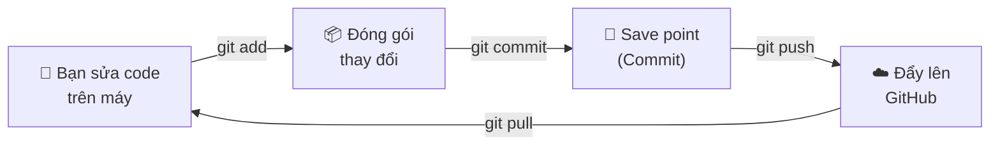
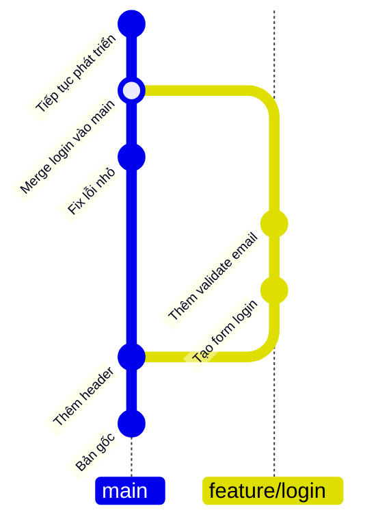
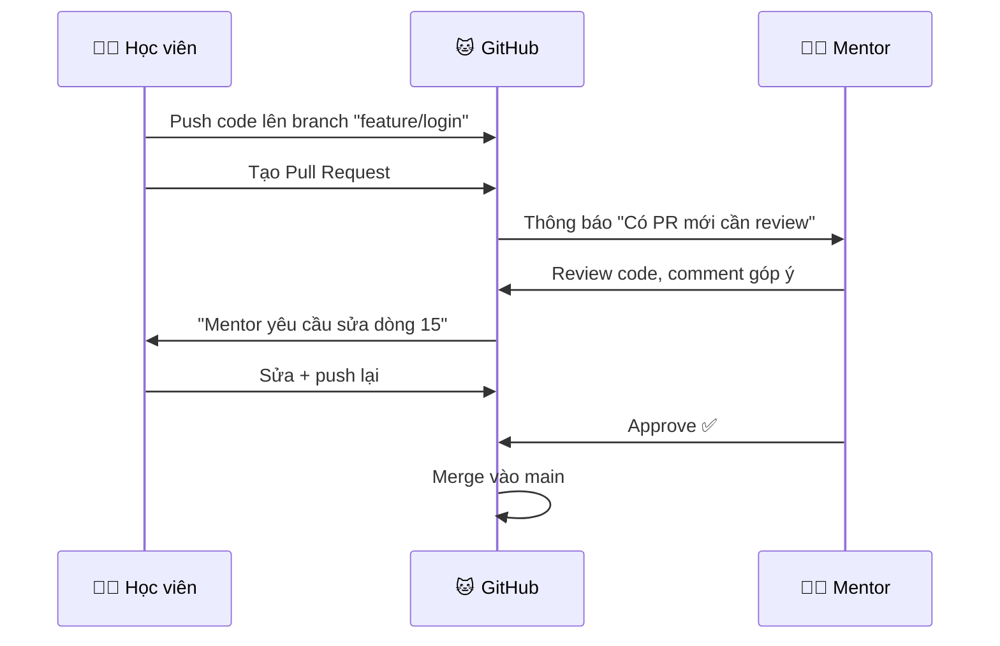
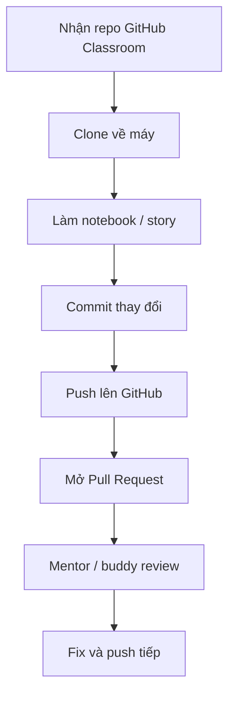

> ⏱️ **Thời lượng:**   
> 🎯 **Mục tiêu:**   

## 1. Git giải quyết vấn đề gì?

Nếu bạn từng đặt tên file như sau, bạn đã gặp vấn đề mà Git sinh ra để giải quyết:

```text
proposal-final.docx
proposal-final-v2.docx
proposal-final-v2-real-final.docx
proposal-final-v2-real-final-dz-edit.docx
```

Git là hệ thống lưu lịch sử thay đổi của project. Nó cho phép bạn biết:

- Ai sửa file nào.
- Sửa lúc nào.
- Sửa nội dung gì.
- Có thể quay lại phiên bản cũ không.
- Nhiều người có thể cùng làm mà ít đạp lên nhau hơn.

## 2. Git — "Save Game" Thông Minh

### Ví von: Save game trong trò chơi

Khi chơi game, bạn **save** trước khi đánh boss. Nếu thua → **load** lại save point.

**Git hoạt động giống hệt vậy**, nhưng mạnh hơn:

| Game | Git |
|------|-----|
| Save 1 file duy nhất | Lưu **toàn bộ** thư mục dự án tại 1 thời điểm |
| Save đè lên save cũ | **Giữ lại tất cả** các lần save trước |
| Chỉ bạn chơi | **Cả team** cùng chơi chung 1 game, mỗi người có save riêng |

> 💡 **Key insight:** Git = hệ thống save game cho code. Mỗi lần save gọi là **commit**. Bạn có thể quay lại bất kỳ commit nào trong quá khứ.

---

## 3. Bốn Hành Động Cốt Lõi

Git có nhiều lệnh, nhưng bạn chỉ cần nhớ **4 cái** cơ bản sau:



| Hành động | Lệnh | Ví von |
|-----------|-------|--------|
| **Add** | `git add .` | Bỏ đồ vào hộp — chọn thay đổi nào muốn lưu |
| **Commit** | `git commit -m "Thêm form đăng ký"` | Dán nhãn lên hộp — ghi chú "hộp này chứa gì" |
| **Push** | `git push` | Gửi hộp lên kho online (GitHub) — team nhìn thấy |
| **Pull** | `git pull` | Lấy hộp mới nhất từ kho về máy bạn |

### Ví dụ thực tế

Bạn vừa tạo xong trang đăng nhập cho đồ án:

```bash
git add .                              # Đóng gói tất cả thay đổi
git commit -m "feat: tạo form đăng nhập"  # Save point + ghi chú
git push                               # Đẩy lên GitHub
```

**Ba dòng. Xong.** Mentor giờ có thể lên GitHub xem code của bạn.

### Commit giống ảnh chụp tiến độ

Commit không phải backup ngẫu nhiên. Commit nên là một mốc có ý nghĩa:

```bash
Tệ:
- update
- fix
- final

Tốt:
- feat(story-01): add magic link login
- fix(schema): prevent negative stock quantity
- docs(readme): add demo instructions
```

Trong khóa này, mỗi story nên có ít nhất một commit 

### Các lệnh Git hỗ trợ khác

Xem file nào đang thay đổi.

```bash
git status
```

Xem lịch sử commit ngắn gọn.

```bash
git log --oneline
```

---

## 4. Những khái niệm Git cần biết

| Khái niệm | Giải thích ngắn | Ví dụ |
|---|---|---|
| Repository / repo | Thư mục project có Git theo dõi | repo đồ án PipeTrack |
| Branch | Nhánh làm việc riêng | `story-02-dashboard` |
| Remote | Bản repo nằm trên GitHub | repo GitHub Classroom |

### 4.1 Repository (Repo) — Thư Mục Project Có Git

**Repo = thư mục project + lịch sử Git.**

Mỗi repo chứa:

- Tất cả code của bạn
- Toàn bộ lịch sử commit (mọi lần save)
- File `README.md` giới thiệu dự án

```text
📁 my-project/          ← Đây là 1 repo
├── .git/               ← Thư mục ẩn — Git lưu lịch sử ở đây
├── README.md           ← Giới thiệu dự án
├── index.html          ← Code của bạn
├── style.css
└── app.js
```

#### Repo ở đâu?

| Nơi | Gọi là | Ví von |
|-----|--------|--------|
| Trên máy bạn | **Local repo** | Bản thảo ở nhà |
| Trên GitHub.com | **Remote repo** | Bản gửi NXB — ai cũng xem được |

Hai bản này được **đồng bộ** qua `push` (đẩy lên) và `pull` (kéo về).

### 4.2 Branch — Bản Nháp Song Song

> 📌 **Đọc qua — dùng khi nào mentor sẽ nhắc.** Branch và Pull Request chỉ thực sự sử dụng từ buổi 4–5 trở đi. Ở giai đoạn đầu, bạn chỉ cần biết `add`, `commit`, `push` trên nhánh `main` là đủ.

#### Ví von: Viết bài báo

Bạn đang viết bài báo bản chính (`main`). Muốn thử thêm 1 đoạn mới mà không sợ hỏng bản chính?

**Tạo bản nháp** → sửa thoải mái → nếu ưng → **ghép vào bản chính**.



| Thuật ngữ | Nghĩa | Khi nào dùng |
|-----------|-------|-------------|
| `main` | Nhánh chính — bản "sạch" luôn hoạt động | Luôn giữ ổn định |
| `branch` | Nhánh phụ — bản nháp để thử | Khi bắt đầu làm 1 tính năng mới |
| `merge` | Ghép nhánh phụ vào nhánh chính | Khi tính năng xong, đã kiểm tra |

> 💡 **Trong khoá học:** Mỗi Story (tính năng nhỏ) bạn sẽ tạo 1 branch → code xong → tạo Pull Request → mentor review → merge.

### 4.3 Pull Request (PR) — "Xin Phép Merge"

Pull Request = bạn nói với mentor: **"Em đã code xong tính năng X, anh/chị review giùm rồi merge vào main nhé?"**



**PR là cách mentor review code của bạn trong khoá học.** Mỗi tuần bạn mở ít nhất 1 PR.

## 5. Luồng làm việc tối thiểu trong khóa




## 6. GitHub UI Cơ Bản — Những Thứ Bạn Sẽ Thấy

### Trang repo trên GitHub

```
┌─────────────────────────────────────────────────┐
│  📁 my-hris-project                         │
│  ─────────────────────────────────────────────── │
│  🔀 main ▼  │  3 branches  │  12 commits        │
│  ─────────────────────────────────────────────── │
│  📄 README.md          ← Mô tả dự án            │
│  📄 index.html         ← Code frontend           │
│  📄 package.json       ← Config dự án            │
│  📁 src/               ← Thư mục code chính      │
│  ─────────────────────────────────────────────── │
│  📝 README.md                                    │
│  "HRIS — Hệ thống quản lý nhân sự..."  │
└─────────────────────────────────────────────────┘
```

**Những tab quan trọng:**

| Tab | Công dụng |
|-----|-----------|
| **Code** | Xem file code hiện tại |
| **Issues** | Báo lỗi, đặt câu hỏi |
| **Pull requests** | Xem PR đang chờ review |
| **Actions** | Tự động kiểm tra code (CI/CD) |

## 7. Quy tắc an toàn

- Không commit file chứa mật khẩu, API key, service key.
- Không xóa lịch sử Git khi chưa hỏi mentor.
- Không copy nguyên thư mục `node_modules` lên GitHub.
- Commit nhỏ, thường xuyên, có thông điệp rõ.
- Nếu AI đề xuất `git reset --hard`, dừng lại và hỏi mentor.

## ✅ Bạn Đã Hiểu Chưa?

1. **Git giải quyết vấn đề gì?** (Gợi ý: nhớ cảnh `FINAL_THATLAFINAL.docx`)
2. **Commit là gì?** Giải thích bằng ví von save game.
3. **Push và Pull khác nhau ra sao?** Cái nào đi lên, cái nào đi xuống?
4. **Branch dùng khi nào?** Vì sao không code thẳng trên `main`?
5. **Pull Request để làm gì trong khoá học?** Ai tạo, ai review?

> 🎯 Nếu trả lời được 5/5 → bạn sẵn sàng!
> Phần thực hành cụ thể (clone, commit, push) sẽ có trong [07 — Hướng Dẫn Cài Đặt Công Cụ](./07-tool-setup-guide.md).

*📖 Quay lại: [01 — Code Là Gì?](./01-what-is-code.md)*  
*📖 Đọc tiếp: [03 — Frontend, Backend, Database & API](./03-frontend-backend-db.md)*

---

## Checklist trước Buổi 1

- [ ] Có tài khoản GitHub.
- [ ] Biết mở repo trên GitHub.
- [ ] Biết xem tab Pull Requests.
- [ ] Biết copy lỗi terminal để hỏi trợ giúp.