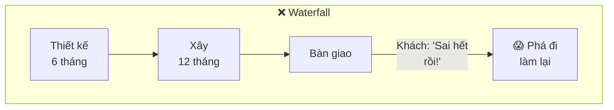
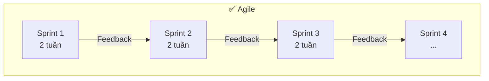
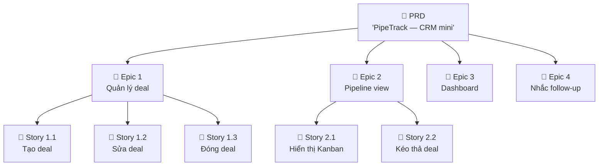
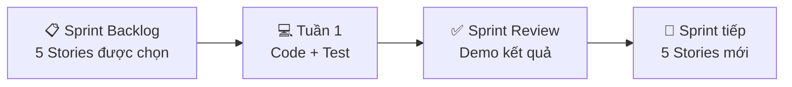
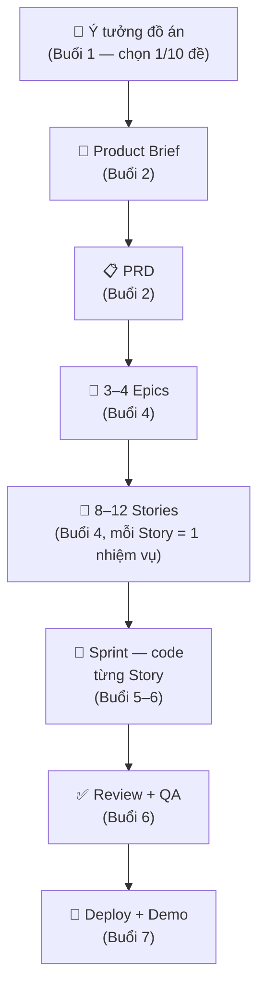

> ⏱️ **Thời lượng:**   
> 🎯 **Mục tiêu:** 

---

## 1. Đặt Vấn Đề: 
### Dự Án Thất Bại Vì Đâu?

Hãy tưởng tượng bạn xây nhà:

**Cách 1 — Waterfall (thác nước):** Vẽ **toàn bộ** bản thiết kế → xây **toàn bộ** → bàn giao. Nếu giữa chừng khách đổi ý "thôi, thêm 1 tầng nữa" → phá đi xây lại 😱.

**Cách 2 — Agile (linh hoạt):** Xây phòng khách trước → khách vào ở thử → feedback "cửa sổ nhỏ quá" → sửa → xây tiếp phòng ngủ → feedback → sửa → tiếp...





> 💡 **Key insight:** Agile = **làm từng miếng nhỏ**, lấy feedback sớm, sửa sớm. Không đợi xong hết mới hỏi ý kiến.

### Vì sao cần Agile khi đã có AI?

AI có thể viết nhanh, dù nhanh nhưng sai hướng vẫn là sai. Agile giúp chia một sản phẩm lớn thành các lát nhỏ có thể kiểm tra được.

Trong khóa này, bạn sẽ không nói với AI:

```text
Hãy build cho tôi một CRM hoàn chỉnh.
```

Bạn sẽ nói theo chuỗi:

```text
Story 01: tạo đăng nhập Magic Link.
Story 02: tạo bảng deals và form thêm deal.
Story 03: tạo pipeline Kanban 5 stage.
Story 04: thêm activity log cho từng deal.
```

Chia nhỏ là cách giữ AI không "lú" và giúp mentor review được.

---

## 2. PRD — "Bản Mô Tả Sản Phẩm" Viết Cho AI Hiểu

### PRD là gì?

**PRD (Product Requirements Document)** = tài liệu mô tả: sản phẩm này **giải quyết vấn đề gì**, cho **ai**, với **tính năng gì**.

PRD tốt trả lời:

- Người dùng là ai?
- Nỗi đau là gì?
- Mục tiêu sản phẩm là gì?
- MVP gồm những tính năng nào?
- Không làm gì trong phiên bản đầu?
- Thành công được đo bằng gì?
  
### Ví von: Menu nhà hàng

Trước khi bếp nấu, nhà hàng cần **menu** rõ ràng:
- **Món phục vụ ai?** Dân văn phòng ăn trưa nhanh.
- **Vấn đề giải quyết?** Không có thời gian nấu cơm.
- **Có gì trong menu?** Cơm trưa, bún bò, phở — KHÔNG CÓ sushi, pizza.
- **Biết thành công khi nào?** Bán được 100 phần/ngày.

**PRD giống hệt menu — nhưng cho ứng dụng:**

| Mục trong PRD | Ví dụ (PipeTrack — CRM mini) |
|---------------|------------------------------|
| **Problem** | Sales team theo dõi deal bằng Excel → mất dữ liệu, quên follow-up |
| **User / Persona** | Sales Executive, B2B, team 5–10 người |
| **MVP Scope** | CRUD deal + pipeline 5 stage + dashboard tổng |
| **Success Metrics** | Đội sales cập nhật deal hàng ngày, win-rate tăng 10% |
| **Out of Scope** | Email marketing, AI scoring, mobile app (chưa làm vội) |

> 💡 **Trong khoá học:** Bạn sẽ dùng AI (cụ thể: `bmad-create-prd`) để **viết PRD**. Nhưng bạn cần hiểu PRD có gì để **review** xem AI viết đúng chưa.

---

## 3. Epic & Story — Cắt Nhỏ Để Dễ Ăn 

### Epic là gì?

**Epic** là một nhóm việc lớn, thường gồm nhiều story.

Ví dụ: Ứng dụng **PipeTrack** có thể chia thành:
- **Epic 1:** Quản lý deal (CRUD cơ bản)
- **Epic 2:** Pipeline view (Kanban 5 cột)
- **Epic 3:** Dashboard báo cáo
- **Epic 4:** Hệ thống nhắc follow-up

Epic giúp bạn nhìn bản đồ lớn mà không chìm trong chi tiết.

### User Story là gì?

**User Story** = 1 tính năng nhỏ (một việc nhỏ từ góc nhìn người dùng), cụ thể, **có thể hoàn thành trong 1–2 ngày**.

Công thức phổ biến:

```text
Là <vai trò>,
tôi muốn <hành động/kết quả>,
để <lợi ích>.
```

Ví dụ:

```text
Là nhân viên kho,
tôi muốn tạo phiếu xuất vật tư bằng một form đơn giản,
để hệ thống tự trừ tồn và lưu lịch sử thay vì sửa Excel thủ công.
```

Story tốt phải đủ nhỏ để AI làm trong một phiên làm việc và đủ rõ để test.

Ví dụ trong **Epic 1: Quản lý deal**:
- Story 1.1: "Là một Sales, tôi muốn **tạo deal mới** (tên cty, giá trị, stage), để theo dõi khách hàng tiềm năng."
- Story 1.2: "Là một Sales, tôi muốn **sửa thông tin deal**, để cập nhật khi khách đổi yêu cầu."
- Story 1.3: "Là một Sales, tôi muốn **đánh dấu deal Won/Lost** + ghi lý do, để biết tỷ lệ thắng."



### Vì sao phải cắt nhỏ?

| Không cắt | Có cắt (Epic → Story) |
|-----------|----------------------|
| "Xây app CRM" — AI không biết bắt đầu từ đâu | "Tạo form thêm deal" — AI hiểu rõ, viết đúng |
| Lỗi 1 chỗ → hỏng hết | Lỗi 1 Story → sửa Story đó, không ảnh hưởng chỗ khác |
| Không biết xong chưa | Mỗi Story có checklist → biết rõ xong hay chưa |

> 💡 **Nguyên tắc hướng dẫn:** Mỗi Story nên tập trung vào **1 nhiệm vụ duy nhất**. Trong thực tế, story được viết tốt thường nằm trong khoảng **60–120 dòng** — đủ để AI đọc toàn bộ mà không "quên đầu". Nếu bạn thấy mình phải viết rất nhiều để mô tả một Story, đó là dấu hiệu cần tách thành 2 story nhỏ hơn.

---

## 4. Sprint — "Tuần Làm Việc Tập Trung"

### Sprint là gì?

**Sprint** = 1 khoảng thời gian cố định (thường 1–2 tuần) để hoàn thành 1 nhóm Story.



### Ví von: Bữa tiệc buffet

Thay vì nấu **tất cả 50 món** rồi mới bày:
- **Sprint 1:** Nấu 5 món khai vị → bày ra → khách ăn thử → feedback.
- **Sprint 2:** Nấu 5 món chính → bày tiếp → feedback.
- **Sprint 3:** Tráng miệng + sửa lại món khai vị khách chê.

**Mỗi sprint ra được "đồ ăn thật"** — không phải chờ đến cuối mới có.

Trong khóa này, mỗi tuần giống một sprint nhỏ:

| Tuần/Buổi | Output chính |
|---|---|
| Buổi 2 | Product Brief + PRD |
| Buổi 3 | Architecture + Schema + UX |
| Buổi 4 | Epic + Story + Build order |
| Buổi 5 | Dev các story đầu |
| Buổi 6 | Review + QA + Deploy |

---

## 5. Acceptance Criteria — "Biết Xong Chưa"

### Vấn đề

Story nói "Tạo form thêm deal" — nhưng **xong** nghĩa là gì? Có form là xong? Hay phải validate? Hay phải lưu vào database?

### Acceptance Criteria (AC) = checklist

AC liệt kê **điều kiện cụ thể, đo được** để biết Story **hoàn thành chưa**:

```markdown
## Story: Tạo deal mới

### Acceptance Criteria:
- [ ] Form có 4 trường: tên công ty, người liên hệ, giá trị deal, stage
- [ ] Trường "tên công ty" bắt buộc — bấm Gửi mà để trống → hiện lỗi
- [ ] Giá trị deal chỉ nhận số dương
- [ ] Sau khi submit → deal xuất hiện trong danh sách
- [ ] Sau khi submit → form reset về trống
```

### Ví von: Mua hàng online

AC giống như **điều kiện trả hàng** của Shopee:
- ✅ Hàng đúng mẫu
- ✅ Hàng không hỏng
- ✅ Đúng số lượng
- ✅ Giao đúng hạn

Đạt hết → ✅ Đơn hàng thành công. Thiếu 1 → ❌ Phải xử lý lại.

> 💡 **Trong khoá học:** AC chính là thứ AI đọc để biết **viết code đến đâu là đủ**. AC rõ → AI code đúng. AC mơ hồ → AI code lung tung.

---

## 6. Definition of Done — "Thật Sự Xong Xong"

**Definition of Done (DoD)** = tiêu chuẩn **chung** cho mọi Story. Khác AC (riêng cho từng Story).

Một story chỉ được xem là xong khi:

- Có file story rõ context, AC, out-of-scope.
- Code đã chạy trên máy local.
- Có commit riêng.
- Không làm vỡ story trước đó.
- Có ghi chú nếu còn nợ kỹ thuật.

Nếu chỉ "AI nói đã xong" thì chưa xong.

**DoD của khoá học:**

```markdown
1. ✅ Code chạy được trên localhost (không lỗi console)
2. ✅ Tất cả Acceptance Criteria đều pass
3. ✅ Đã commit + push lên GitHub
4. ✅ PR được mentor review (ít nhất 1 comment)
5. ✅ Story tập trung 1 nhiệm vụ (khuyến nghị 60–120 dòng)
```

---

## 7. Tất Cả Gộp Lại — Luồng Agile Trong Khoá Học



---

## 8. Bảng Tóm Tắt Thuật Ngữ

| Thuật ngữ | Nghĩa | Một câu nhớ nhanh |
|-----------|-------|--------------------|
| **Agile** | Phương pháp làm từng phần nhỏ, feedback sớm | "Lắp Lego, không xây nhà 1 lần" |
| **Waterfall** | Làm hết rồi mới giao | "Xây xong cả nhà mới hỏi ý kiến" |
| **PRD** | Tài liệu mô tả sản phẩm | "Menu nhà hàng — có gì, cho ai" |
| **Epic** | Mảng lớn của sản phẩm | "1 chương trong sách" |
| **User Story** | Tính năng nhỏ, cụ thể | "1 trang trong chương" |
| **Sprint** | Tuần làm việc tập trung | "Nấu 5 món cho bữa buffet" |
| **Acceptance Criteria** | Checklist "xong chưa" cho 1 Story | "Điều kiện trả hàng Shopee" |
| **Definition of Done** | Tiêu chuẩn chung cho mọi Story | "Quy định chung cả lớp" |

---

## ✅ Bạn Đã Hiểu Chưa?

1. **Agile khác Waterfall ra sao?** Dùng ví von xây nhà vs Lego.
2. **PRD chứa gì?** Kể 3 mục bắt buộc.
3. **Epic và Story khác nhau ra sao?** Cái nào lớn hơn?
4. **Vì sao mỗi Story nên tập trung vào 1 nhiệm vụ duy nhất?** (Gợi ý: AI xử lý tốt hơn khi không phải "nhớ" quá nhiều thứ cùng lúc)
5. **Acceptance Criteria dùng để làm gì?** Thiếu AC thì AI code kiểu nào?

> 🎯 Bạn sẽ được hỏi những câu này ở đầu buổi 2!

---

*📖 Quay lại: [03 — Frontend, Backend, Database & API](./03-frontend-backend-db.md)*  
*📖 Đọc tiếp: [05 — AI Agent Là Gì?](./05-ai-agent-concept.md)*
