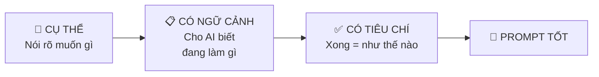
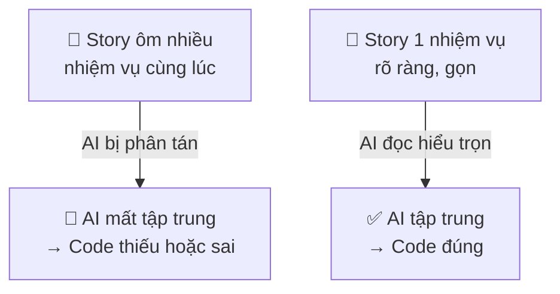
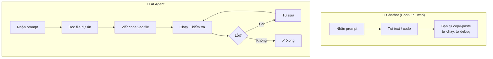
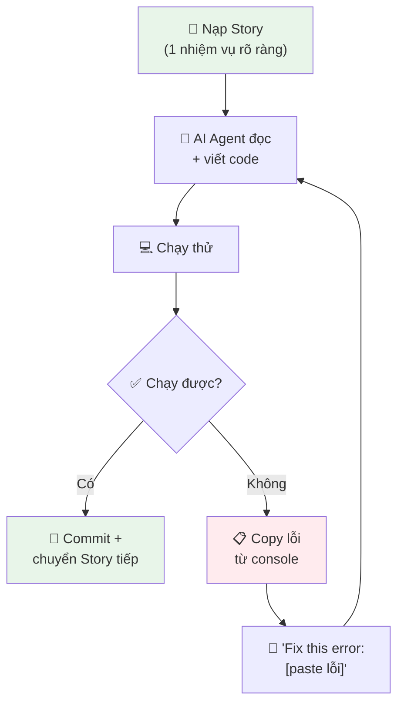

# 05 — AI Agent Là Gì?

> ⏱️ **Thời lượng:**   
> 🎯 **Mục tiêu:** 

---

## 1. LLM — "Bộ Não Đã Đọc Cả Thư Viện"

### LLM là gì?

**LLM (Large Language Model)** = mô hình ngôn ngữ lớn. Nôm na: một "bộ não nhân tạo" đã được **đọc hàng tỷ trang** sách, Wikipedia, code, báo, luận văn... và học cách **viết tiếp câu** dựa trên những gì đã đọc.

```
Ví von: Tưởng tượng có 1 người đã đọc:
- Toàn bộ Wikipedia (tiếng Anh + tiếng Việt)
- 1 triệu cuốn sách
- 100 triệu bài code trên GitHub
- Mọi bài blog kỹ thuật trên internet

Bạn hỏi gì, người đó trả lời dựa trên "trí nhớ" khổng lồ này.
```

### Những LLM bạn sẽ gặp trong khoá học

| LLM                       | Nhà sản xuất | Dùng ở đâu                          |
| ------------------------- | ------------ | ----------------------------------- |
| **Claude** (Sonnet, Opus) | Anthropic    | Claude Code, Antigravity Agent      |
| **GPT-4o / GPT-5**        | OpenAI       | ChatGPT, Antigravity Agent          |
| **Gemini**                | Google       | Google AI Studio, Antigravity Agent |

> 💡 **Antigravity Agent** là code editor tích hợp AI Agent — bạn có thể chọn sử dụng nhiều LLM khác nhau (Claude, GPT, Gemini) bên trong Antigravity. Nó không phải LLM mà là **nền tảng** để bạn làm việc với LLM.

> 💡 **Key insight:** LLM không "hiểu" theo nghĩa con người. Nó **dự đoán từ tiếp theo** cực giỏi — giỏi đến mức trông như hiểu. Nó dự đoán câu trả lời hợp lý dựa trên dữ liệu, prompt và context bạn cung cấp.

---

## 2. Prompt — "Câu Hỏi Bạn Đưa Cho AI"

### Prompt là gì?

**Prompt** = chỉ dẫn / yêu cầu / câu hỏi bạn gửi cho AI.

**Prompt tệ vs Prompt tốt:**

| Prompt tệ 😕 | Prompt tốt ✅ |
|-------------|-------------|
| "Làm app cho tôi" | "Tạo form đăng ký có 3 trường: tên, email, số điện thoại. Khi bấm Gửi, validate email đúng format, hiện thông báo thành công." |
| "Sửa lỗi" | "Khi bấm nút Submit, console hiện lỗi 'TypeError: Cannot read property of null'. Đây là code lỗi: [dán code]. Hãy fix." |
| "Code đẹp hơn" | "Đổi màu nền header thành gradient từ #1e3a5f sang #2d5a87, font chữ Inter, border-radius 12px." |

### Quy tắc prompt vàng



> 💡 **Key insight:** AI giỏi bao nhiêu phụ thuộc vào prompt của bạn rõ ràng bao nhiêu. Skill #1 của Vibe Coding = **viết prompt tốt**.

---

## 3. Context Window — "Bàn Làm Việc" Của AI

### Context window là gì?

**Context window** = "bàn làm việc" của AI — lượng thông tin AI có thể **nhớ cùng lúc** trong 1 cuộc trò chuyện.

```
Ví von: Bạn có 1 bàn làm việc. Bàn nhỏ → chỉ để được 5 tờ giấy.
Muốn đọc tờ thứ 6 → phải bỏ 1 tờ cũ ra.

Context window của AI cũng vậy:
- Claude: ~1.000.000 token
- GPT-5: ~1.050.000 token
```

https://developers.openai.com/api/docs/models/compare?model=gpt-5.4
https://platform.claude.com/docs/en/about-claude/models/overview
### Vì sao quan trọng?



**Đây là lý do khoá học khuyến nghị mỗi Story chỉ mô tả 1 nhiệm vụ:** để AI luôn "thấy" toàn bộ yêu cầu trên "bàn làm việc" mà không bị phân tán. Trong thực tế, điều này thường dẫn đến story trong khoảng 60–120 dòng — nhưng con số không phải quy tắc cứng, **sự tập trung mới là điều quan trọng**.

### Khi nào context bị "đầy"?

- Chat dài → tin nhắn cũ bị "rơi" khỏi bàn
- Paste file code quá lớn → AI chỉ nhớ phần cuối
- Nhiều file cùng lúc → AI lẫn lộn giữa các file

**Giải pháp:** Lệnh `/compact` — dọn sạch bàn, bắt đầu lại. Bạn sẽ dùng lệnh này thường xuyên ở buổi 5.

---

## 4. Hallucination — "AI Bịa, Tự Tin Nhưng Sai"

### Hallucination là gì?

Đôi khi AI **trả lời rất tự tin** nhưng **hoàn toàn sai**. Hiện tượng này gọi là **hallucination** (ảo giác).

```
Ví von: Bạn hỏi đường 1 người rất tự tin.
"À, đi thẳng 200m, rẽ trái, quán cà phê ABC ngay góc."
Bạn đi → không có quán nào cả. Người đó không nói dối — 
họ THẬT SỰ TIN là đúng, nhưng nhớ sai.

AI cũng vậy. Nó không "cố ý" bịa. Nó dự đoán từ tiếp theo
dựa trên pattern, và đôi khi pattern dẫn đến sai.
```

### Ví dụ hallucination thường gặp

| Loại | Ví dụ |
|------|-------|
| **Bịa API** | "Dùng hàm `supabase.magicSearch()`" — hàm này không tồn tại |
| **Bịa thư viện** | "Import `react-kanban-pro`" — package không có trên npm |
| **Code trông đúng nhưng sai logic** | Hàm tính tổng nhưng quên cộng dòng cuối |
| **Tự tin giải thích sai** | "RLS chỉ hoạt động với MySQL" — sai, RLS là của PostgreSQL |

### Cách phát hiện

1. **Code không chạy** → lỗi console = dấu hiệu #1
2. **Tên hàm / package lạ** → Google kiểm tra xem có thật không
3. **Logic "nghe hay nhưng thiếu"** → đọc lại AC, so với output

> 💡 **Key insight:** AI **không bao giờ 100% đúng**. Luôn kiểm tra kết quả. Bạn là người ra quyết định cuối cùng, không phải AI.

---

## 5. Persona / Role — "Đeo Mặt Nạ Cho AI"

### Persona là gì?

**Persona** = giao cho AI 1 vai trò cụ thể để nó trả lời **theo chuyên môn** của vai đó.

```
Ví von: Cùng 1 câu hỏi "Nên làm app như thế nào?":
- Hỏi BẾP TRƯỞNG → trả lời về UX/giao diện nấu ăn
- Hỏi KẾ TOÁN → trả lời về tính năng sổ sách, thuế
- Hỏi KỸ SƯ → trả lời về stack công nghệ, database
```

**Trong BMAD, mỗi Agent đã được gắn persona sẵn:**

| Agent | Persona | Chuyên môn |
|-------|---------|-----------|
| **John** (PM) | Product Manager kinh nghiệm | Viết PRD, phỏng vấn yêu cầu |
| **Winston** (Architect) | Kiến trúc sư hệ thống | Chọn tech stack, thiết kế schema |
| **Sally** (UX) | UX Designer | Wireframe, user flow, 4 states |
| **Amelia** (Dev) | Senior Developer | Viết code, implement Story |
| **Paige** (Tech Writer) | Chuyên gia tài liệu | README, docs, giải thích rõ ràng |

> 💡 **Bạn không cần tự viết persona** — BMAD đã làm sẵn. Bạn chỉ cần gọi đúng Agent cho đúng việc.

---

## 6. AI Agent vs Chatbot — Khác Biệt Cốt Lõi

### Chatbot = trả lời

```
Bạn: "Viết code form đăng ký"
Chatbot: "Đây là code: [code]"
→ Bạn phải TỰ TAY copy, paste, tạo file, chạy, debug
```

### AI Agent = hành động

```
Bạn: "Tạo form đăng ký có tên, email, validate"
AI Agent:
  1. Đọc cấu trúc dự án hiện tại
  2. Tạo file mới tại đúng vị trí
  3. Viết code vào file
  4. Kiểm tra lỗi
  5. Sửa nếu có lỗi
  6. Chạy thử
→ Bạn CHỈ CẦN review kết quả
```



| | Chatbot | AI Agent |
|---|---------|----------|
| **Truy cập file** | ❌ Không | ✅ Đọc/viết file dự án |
| **Chạy code** | ❌ Không | ✅ Chạy terminal |
| **Tự sửa lỗi** | ❌ Không | ✅ Đọc lỗi → sửa → chạy lại |
| **Nhớ cấu trúc dự án** | ❌ Không | ✅ Quét thư mục, đọc config |
| **Ví dụ** | ChatGPT web, Gemini web | Antigravity Agent, Claude Code |

> 💡 **Trong khoá học bạn dùng AI Agent** không phải chatbot web. Đây là khác biệt then chốt khiến Vibe Coding khả thi.

---

## 7. Vibe Coding — Vòng Lặp Cốt Lõi

Bạn đã gặp khái niệm này ở [bài 01](./01-what-is-code.md). Giờ mình đi sâu vào **vòng lặp** thực tế:



**4 bước lặp đi lặp lại:**

| Bước | Bạn làm | AI làm |
|------|---------|--------|
| 1. Nạp Story | Mở file Story, paste vào AI hoặc mention file và yêu cầu AI Agent tự Dev | — |
| 2. AI code | — | Đọc yêu cầu, viết code |
| 3. Kiểm tra | Xem app chạy chưa, đúng AC chưa | — |
| 4. Fix lỗi | Copy lỗi, bảo "Fix this" | Đọc lỗi, sửa code |

**Lặp bước 2–4** cho đến khi Story xong → commit → chuyển Story tiếp.

> 💡 **"Ném lỗi"** là kỹ thuật quan trọng nhất: khi app lỗi, **đừng tự sửa code** — copy nguyên lỗi, ném cho AI. AI sửa nhanh hơn bạn rất nhiều.

---

## 8. Bảng Tóm Tắt Thuật Ngữ

| Thuật ngữ | Nghĩa | Một câu nhớ nhanh |
|-----------|-------|--------------------|
| **LLM** | Mô hình ngôn ngữ lớn | "Bộ não đã đọc cả thư viện" |
| **Prompt** | Chỉ dẫn bạn gửi cho AI | "Câu hỏi / yêu cầu" |
| **Context Window** | Lượng info AI nhớ cùng lúc | "Bàn làm việc — đầy thì phải dọn" |
| **Hallucination** | AI bịa, tự tin nhưng sai | "Chỉ đường rất tự tin nhưng sai" |
| **Persona** | Vai trò gán cho AI | "Đeo mặt nạ chuyên gia" |
| **AI Agent** | AI biết hành động (đọc/viết file, chạy code) | "Trợ lý biết LÀM, không chỉ NÓI" |
| **Chatbot** | AI chỉ trả lời text | "Trợ lý chỉ NÓI, không LÀM" |
| **Vibe Coding** | Bạn dẫn dắt, AI viết code | "Nhạc trưởng + dàn nhạc AI" |
| **Ném lỗi** | Copy lỗi → paste cho AI sửa | "Lỗi = thức ăn cho AI" |

---

## ✅ Bạn Đã Hiểu Chưa?

1. **LLM "hiểu" ngôn ngữ theo nghĩa nào?** (Gợi ý: dự đoán từ tiếp theo)
2. **Context window là gì?** Khi nào cần `/clear`?
3. **Hallucination là gì?** Cho 1 ví dụ và cách phát hiện.
4. **AI Agent khác Chatbot ra sao?** Nêu 2 khác biệt chính.
5. **Vòng lặp Vibe Coding có mấy bước?** Bước nào quan trọng nhất?

> 🎯 Trả lời được 5/5 → bạn đã sẵn sàng hiểu BMAD ở bài tiếp theo!

---

*📖 Quay lại: [04 — Agile & Scrum Cho Người Mới](./04-agile-scrum-101.md)*  
*📖 Đọc tiếp: [06 — Tổng Quan BMAD Framework](./06-bmad-overview.md)*
