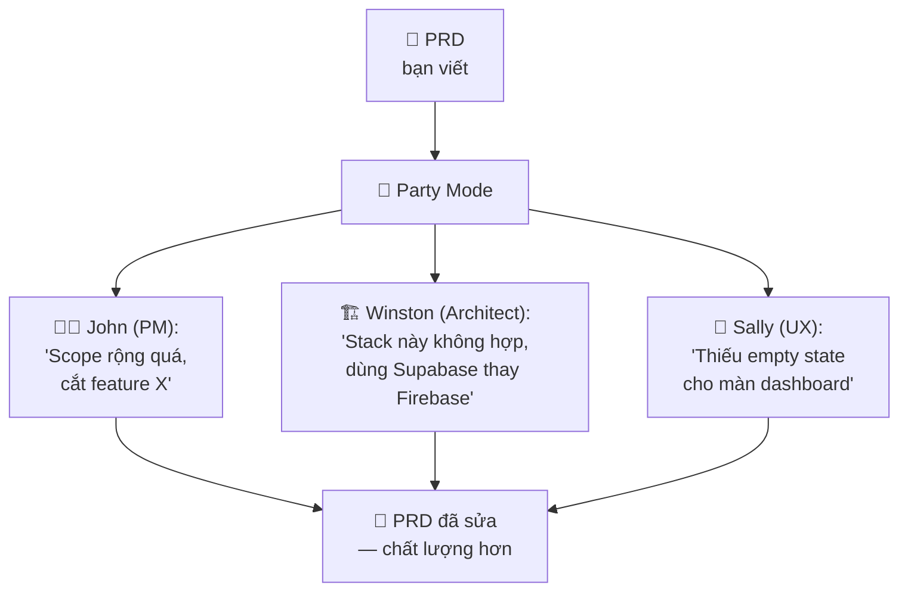
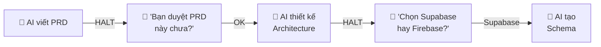
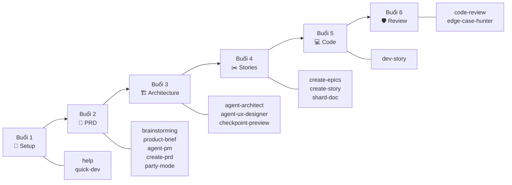
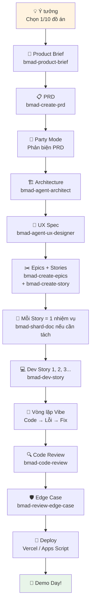

> ⏱️ **Thời lượng:**   
> 🎯 **Mục tiêu:** 

---

## 1. BMAD Là Gì?

**BMAD = một đội ngũ AI chuyên nghiệp** — mỗi "nhân viên AI" có vai trò riêng (PM, Architect, Dev, QA, Tech Writer...), phối hợp cùng nhau để giúp bạn **xây phần mềm từ ý tưởng đến deploy**.

### Ví von: Công ty xây nhà

```
Bạn = Chủ nhà (có ý tưởng, ra quyết định cuối)

BMAD = Công ty xây dựng với đội ngũ:
├── 🧑‍💼 John (PM)         — Hỏi bạn muốn nhà thế nào, viết bản mô tả
├── 🏗️ Winston (Architect) — Thiết kế kết cấu, chọn vật liệu
├── 🎨 Sally (UX Designer)  — Thiết kế nội thất, layout phòng
├── 👷 Amelia (Dev)          — Xây thật, đổ bê-tông, lắp điện
├── 🔍 QA team              — Kiểm tra an toàn, tìm lỗi
└── 📝 Paige (Tech Writer)  — Viết sổ tay sử dụng nhà
```

**Bạn không cần phải giỏi tất cả** — bạn chỉ cần biết **gọi đúng người, đúng lúc**.

### BMAD ≠ 1 chatbot

| ChatGPT thường | BMAD |
|----------------|------|
| 1 AI "biết mọi thứ" nhưng không sâu | Nhiều Agent, mỗi Agent **chuyên** 1 lĩnh vực |
| Trả lời rồi quên | Lưu kết quả thành file, dùng lại được |
| Bạn tự quản lý workflow | **BMAD dẫn dắt** bạn qua từng bước |
| Không có cấu trúc | Có **quy trình chuẩn**: PRD → Architecture → Epic → Dev → Review |

---

## 2. Năm Cơ Chế Lõi — "Bí Mật" Đằng Sau BMAD

BMAD mạnh không chỉ vì có nhiều Agent, mà vì 5 cơ chế "ngầm" bên dưới:

### 2.1. Kiến Trúc Micro-file (Micro-file Architecture)

```
Ví von: Bạn không nhét cả cuốn tiểu thuyết vào 1 tin nhắn rồi gửi đi.
Bạn gửi từng trang, và khi người nhận đọc xong trang 1 → gửi trang 2.
```

**Vấn đề:** AI có context window giới hạn (xem [bài 05](./05-ai-agent-concept.md)). Nhồi quá nhiều → AI quên đầu khi đọc cuối.

**Giải pháp BMAD:** Chia mọi thứ thành **file nhỏ**, mỗi file tập trung vào 1 nhiệm vụ (thường 60–120 dòng):

```
skills/bmad-create-prd/
├── SKILL.md          ← Giới thiệu skill (10 dòng)
├── workflow.md        ← Luồng tổng (20 dòng)
└── steps/
    ├── step-01-gather-info.md    ← Bước 1 (50 dòng)
    ├── step-02-write-draft.md    ← Bước 2 (60 dòng)
    └── step-03-review.md         ← Bước 3 (40 dòng)
```

AI **chỉ tải 1 step** vào context tại 1 thời điểm → luôn "tỉnh táo".

Lợi ích:

- AI đọc ít hơn nhưng đúng hơn.
- Dễ review từng phần.
- Dễ sửa một step mà không phá toàn bộ.
- Học viên không bị choáng bởi tài liệu quá dài.

### 2.2. Nhập Vai & Độc Lập Tư Duy (Persona & Parallel Thinking)

**Mỗi Agent có "linh hồn" riêng** — không phải AI chung chung và đóng 1 hoặc nhiều vai: PM, Architect, UX, Dev, Tech Writer, QA. Khi cần phản biện, BMAD có thể cho nhiều vai cùng nhìn một vấn đề.

```yaml
# John - Product Manager
Identity: "PM kinh nghiệm 10 năm, sắc bén trong phân tích yêu cầu"
Communication: "Hỏi nhiều câu gắt để làm rõ yêu cầu mờ"
Principles: "Không bao giờ code trước khi hiểu rõ vấn đề"
```

**Đặc biệt: Party Mode** 🎉 — Nhiều Agent **tranh luận** cùng 1 chủ đề:



Mỗi Agent **không biết Agent khác nói gì** → tránh "đồng hóa tư duy" (ai cũng gật đầu theo ý đầu tiên).

### 2.3. Quản Trị Ngữ Cảnh Động (Dynamic Context Injection)

```
Ví von: Mỗi khi bạn mời thợ sửa ống nước đến nhà,
bạn phải giải thích lại: "Nhà tôi ở tầng 3, ống nước loại X,
lần trước sửa chỗ Y." Mệt.

BMAD tự động lưu những thông tin này vào file config.
Mỗi Agent khi được gọi → tự đọc config → BIẾT SẴN background.
```

**Hai file quan trọng:**

| File | Chứa gì | Ví dụ |
|------|---------|-------|
| `config.yaml` | Tên bạn, ngôn ngữ, thư mục output | `user_name: dz`, `communication_language: vietnamese` |
| `project-context.md` | Tech stack, quy ước code, cấu trúc dự án | "Dùng Next.js + Supabase + shadcn/ui" |

→ AI **tự nạp** các file này vào bộ nhớ — bạn không cần nhắc lại nhiều lần.

### 2.4. Human-in-the-Loop (HITL)

```
Ví von: GPS dẫn đường nhưng luôn hỏi bạn ở ngã rẽ:
"Rẽ trái đi đường ngắn, hay rẽ phải qua đường đẹp?"
Bạn CHỌN, GPS THỰC HIỆN.
```

BMAD **không tự chạy từ đầu đến cuối**. Nó dừng lại hỏi ý kiến bạn tại các "khúc cua quan trọng":



**Bạn luôn là người ra quyết định cuối.** AI chỉ đề xuất.

### 2.5. Cơ Chế Lưu Vết (Append-only)

```
Ví von: Mọi cuộc họp đều có biên bản.
Biên bản KHÔNG BAO GIỜ bị xoá — chỉ thêm phiên bản mới.
```

Mọi output của BMAD đều được **lưu thành file Markdown** trong thư mục dự án:

```
my-project/
├── PRD.md                 ← PRD do John (PM) viết
├── ARCHITECTURE.md        ← Kiến trúc do Winston viết
├── UX-SPEC.md             ← UX spec do Sally viết
├── epics/
│   ├── epic-01-auth.md
│   └── epic-02-crud.md
├── stories/
│   ├── story-01-login.md
│   └── story-02-create-ticket.md
└── reviews/
    ├── REVIEW-LOGIC.md    ← Code review
    └── REVIEW-EDGE.md     ← Edge case review
```

→ Không mất theo lịch sử chat. Mở file là thấy lại toàn bộ.

---

## 3. Hệ Sinh Thái Skill

BMAD có hơn **60 skill**, gom thành 8 nhóm lớn: Chuyên gia, Chiến lược, Nghiên cứu, Quản trị sản phẩm, Phát triển, Kiểm thử, Phản biện, và Công cụ.

> 💡 **Bạn không cần nhớ hết 60+ skill!** Khoá học chỉ dùng **16 skill core** — đủ để xây 1 ứng dụng hoàn chỉnh. Bảng chi tiết 8 nhóm sẽ được giới thiệu dần trong các buổi học.

---

## 4. 16 Skill Core — Bản Đồ Khoá Học

Đây là 16 skill bạn **thực sự dùng** trong 6 buổi, sắp xếp theo buổi:

| Buổi | Skill | Làm gì |
|------|-------|--------|
| **1** | `bmad-help` | Hỏi BMAD cách dùng, bắt đầu từ đâu |
| **1** | `bmad-quick-dev` | Build nhanh — landing page, fix lỗi |
| **2** | `bmad-brainstorming` | Sinh 15+ ý tưởng tính năng (SCAMPER) |
| **2** | `bmad-product-brief` | Viết bản mô tả sản phẩm 1 trang |
| **2** | `bmad-agent-pm` (John) | PM phỏng vấn ngược, hỏi gắt |
| **2** | `bmad-create-prd` | Viết PRD chuẩn |
| **2, 3** | `bmad-party-mode` | Nhiều Agent tranh luận phản biện |
| **3** | `bmad-agent-architect` (Winston) | Thiết kế kiến trúc + schema |
| **3** | `bmad-agent-ux-designer` (Sally) | Wireframe + UX spec |
| **3** | `bmad-checkpoint-preview` | Review cùng mentor |
| **4** | `bmad-create-epics-and-stories` | Chia PRD thành Epic |
| **4** | `bmad-create-story` | Viết User Story chi tiết |
| **4** | `bmad-shard-doc` | Tách file quá dài hoặc đa nhiệm vụ |
| **5** | `bmad-dev-story` | Code theo Story |
| **6** | `bmad-code-review` | Review code tìm lỗi logic |
| **6** | `bmad-review-edge-case-hunter` | Tìm edge case (user phá) |



---

## 5. Luồng Dự Án BMAD — Từ Ý Tưởng Đến Deploy

Toàn bộ khoá học đi theo 1 luồng rõ ràng:



---

## 6. Cách Gọi 1 Skill

Trong Antigravity hoặc Claude Code, bạn gọi skill bằng cách **gõ tên skill** trong chat:

```
Bạn: "Dùng bmad-brainstorming để sinh ý tưởng cho ứng dụng quản lý kho"
AI:  → Tự tìm skill → Chạy theo workflow → Hỏi bạn chọn phương pháp
     → Sinh ra 15+ ý tưởng → Lưu thành file
```

**Tips:**
- Gõ `bmad-help` bất cứ lúc nào để hỏi "giờ nên làm gì?"
- Mỗi skill có `SKILL.md` mô tả chính xác nó làm gì — bạn có thể đọc trước

---

## 7. "Bản Đồ Nhanh" — Khi Nào Gọi Ai?

| Bạn đang ở đâu? | Gọi skill nào? |
|------------------|----------------|
| "Có ý tưởng nhưng chưa rõ" | `bmad-brainstorming` hoặc `bmad-product-brief` |
| "Cần viết PRD" | `bmad-create-prd` |
| "PRD xong, giờ sao?" | `bmad-party-mode` để phản biện |
| "Cần thiết kế database" | `bmad-agent-architect` (Winston) |
| "Cần wireframe / UX" | `bmad-agent-ux-designer` (Sally) |
| "Cần chia việc" | `bmad-create-epics-and-stories` → `bmad-create-story` |
| "File Story dài quá" | `bmad-shard-doc` |
| "Code theo Story" | `bmad-dev-story` |
| "Build / fix nhanh" | `bmad-quick-dev` |
| "Review code" | `bmad-code-review` |
| "Tìm edge case" | `bmad-review-edge-case-hunter` |
| "Không biết bắt đầu từ đâu" | `bmad-help` |

---

## 8. Bảng Tóm Tắt Thuật Ngữ BMAD

| Thuật ngữ | Nghĩa | Một câu nhớ nhanh |
|-----------|-------|--------------------|
| **BMAD** | Framework đội ngũ AI Agent | "Công ty xây nhà AI" |
| **Micro-file** | 1 file = 1 nhiệm vụ (60–120 dòng là vùng tốt nhất) | "Gửi từng trang, không gửi cả cuốn" |
| **Persona** | Vai trò riêng của mỗi Agent | "Mỗi nhân viên AI có tính cách + chuyên môn" |
| **Party Mode** | Nhiều Agent tranh luận | "Họp ban giám đốc AI" |
| **Dynamic Context** | Tự đọc config + project info | "AI tự nhớ background, không cần nhắc" |
| **HITL** | Dừng hỏi ý kiến người dùng | "GPS hỏi bạn ở ngã rẽ" |
| **Append-only** | Lưu output thành file Markdown | "Biên bản họp — không bao giờ mất" |
| **Skill** | 1 khả năng cụ thể của BMAD | "1 nghề — viết PRD, review code..." |
| **Workflow** | Luồng các bước trong 1 skill | "Quy trình làm việc của 1 nghề" |

---

## ✅ Bạn Đã Hiểu Chưa?

1. **BMAD khác ChatGPT thường ra sao?** Nêu 2 khác biệt chính.
2. **5 cơ chế lõi là gì?** Kể tên + giải thích ngắn bằng ví von.
3. **Micro-file giải quyết vấn đề gì?** (Gợi ý: liên quan context window)
4. **Party Mode hoạt động thế nào?** Vì sao không cho Agent đọc ý kiến nhau?
5. **Khi "không biết bắt đầu từ đâu", gọi skill nào?**

> 🎯 Đây là bài dài nhất trong Primer Pack. Nếu hiểu được bài này → bạn nắm được "bức tranh toàn cảnh" trước khi bước vào khoá học!

---

*📖 Quay lại: [05 — AI Agent Là Gì?](./05-ai-agent-concept.md)*  
*📖 Đọc tiếp: [07 — Hướng Dẫn Cài Đặt Công Cụ](./07-tool-setup-guide.md)*
