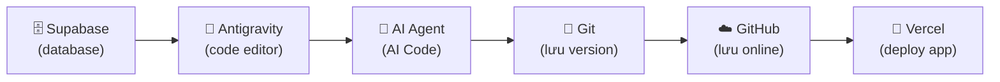

> ⏱️ **Thời lượng:**  (đọc + thực hành)  
> 🎯 **Mục tiêu:** 

---

## 0. Tổng Quan Công Cụ

| Công cụ | Mục đích | Miễn phí? |
|---------|----------|-----------|
| **Node.js** | Chạy code JavaScript trên máy | ✅ |
| **Git** | Quản lý version code | ✅ |
| **GitHub** | Lưu code online + GitHub Classroom | ✅ |
| **Antigravity** | Code editor + AI Agent tích hợp | ✅ (free tier) |
| **AI Agent Code Extensions/Terminal** (tuỳ chọn) | Các AI Agent chạy editor hoặc terminal như Claude Code, Codex (OpenAI), OpenCode | ✅ (free tier) |
| **Supabase** | Database + Auth + API miễn phí | ✅ (free tier) |



---

## 1. Cài Node.js

Node.js cho phép chạy JavaScript trên máy tính (không chỉ trong trình duyệt).

### macOS

```bash
# Cách 1: Dùng Homebrew (khuyến nghị)
brew install node

# Cách 2: Download trực tiếp
# Vào https://nodejs.org → Download LTS → Cài bình thường
```

### Windows

1. Vào **https://nodejs.org**
2. Bấm nút **Download LTS** (Long Term Support — phiên bản ổn định)
3. Chạy file `.msi` → Next → Next → Install
4. **Quan trọng:** Tick ✅ "Add to PATH" khi được hỏi

### Kiểm tra đã cài thành công

Mở Terminal (macOS) hoặc Command Prompt/PowerShell (Windows):

```bash
node --version
# Kết quả mong đợi: v20.x.x hoặc v22.x.x

npm --version
# Kết quả mong đợi: 10.x.x
```

> ✅ Thấy số version → thành công!
> ❌ Thấy "command not found" → xem phần [Troubleshooting](#10-troubleshooting).

---

## 2. Cài Git

### macOS

```bash
# Git thường đã có sẵn. Kiểm tra:
git --version

# Nếu chưa có, cài qua Homebrew:
brew install git
```

### Windows

1. Vào **https://git-scm.com/downloads**
2. Download bản Windows → Cài
3. **Quan trọng:** Chọn "Git from the command line and also from 3rd-party software" khi được hỏi

### Cấu hình Git (bắt buộc — làm 1 lần)

```bash
git config --global user.name "Tên bạn"
git config --global user.email "email@example.com"
```

> ⚠️ **Email phải trùng** với email GitHub bạn sẽ tạo ở bước 3!

---

## 3. Tạo Tài Khoản GitHub

1. Vào **https://github.com** → Sign up
2. Nhập username, email, password
3. Xác nhận email
4. **Hoàn thành!**

### Trang Profile của bạn

```
┌─────────────────────────────────────────────┐
│  👤 your-username                            │
│  ─────────────────────────────────────────── │
│  📊 0 repositories  │  0 followers           │
│  ─────────────────────────────────────────── │
│  📁 Repositories:                            │
│     (trống — bạn sẽ có repo sau buổi 1)     │
└─────────────────────────────────────────────┘
```

### Thiết lập SSH key (khuyến nghị)

SSH key giúp bạn push code **không cần nhập mật khẩu** mỗi lần thực hiện:

```bash
# 1. Tạo SSH key
ssh-keygen -t ed25519 -C "email@example.com"
# Bấm Enter 3 lần (chấp nhận mặc định)

# 2. Copy key
# macOS:
cat ~/.ssh/id_ed25519.pub | pbcopy

# Windows (PowerShell):
Get-Content ~/.ssh/id_ed25519.pub | Set-Clipboard
```

3. Vào **GitHub → Settings → SSH and GPG keys → New SSH key**
4. Paste key → Save

### Kiểm tra

```bash
ssh -T git@github.com
# Kết quả mong đợi: "Hi your-username! You've successfully authenticated..."
```

---

## 4. Cài Antigravity

**Antigravity** là code editor (giống VS Code) với **AI Agent tích hợp sẵn** — đây là công cụ chính của khoá học.

1. Vào **https://antigravity.google**
2. Download → Cài đặt
3. Mở Antigravity → đăng nhập (có thể dùng GitHub account)

### Giao diện Antigravity

```
┌─────────────────────────────────────────────────────┐
│  📁 Explorer     │  📝 Code Editor                   │
│  (cây thư mục)   │  (viết code ở đây)                │
│                   │                                   │
│  my-project/      │  <h1>Hello World</h1>             │
│  ├── index.html   │  <p>Ứng dụng đầu tiên</p>        │
│  ├── style.css    │                                   │
│  └── app.js       │                                   │
│                   ├───────────────────────────────────│
│                   │  💬 AI Chat (Cmd/Ctrl + L)        │
│                   │  "Thêm dark mode toggle..."       │
│                   │  🤖 "Tôi sẽ thêm nút toggle..."  │
└─────────────────────────────────────────────────────┘
```

**Phím tắt quan trọng:**

| Phím tắt | Chức năng |
|----------|-----------|
| `Cmd/Ctrl + L` | Mở AI chat panel |
| `Cmd/Ctrl + K` | AI edit inline (chọn code → hỏi AI sửa) |
| `Cmd/Ctrl + J` | Mở terminal |
| `Cmd/Ctrl + Shift + P` | Command palette |

---

## 5. Claude Code (tuỳ chọn)

**Claude Code** là AI Agent chạy **trong terminal** — mạnh mẽ hơn Antigravity chat vì có thể tự chạy lệnh, tạo file, debug.

### Cài đặt

```bash
# Cài Claude Code CLI
npm install -g @anthropic-ai/claude-code

# Kiểm tra
claude --version
```

### Sử dụng cơ bản

```bash
# Mở thư mục dự án
cd my-project

# Gọi Claude Code
claude

# Trong chat Claude Code:
> "Tạo file index.html với form đăng ký có tên và email"
# → Claude Code tự tạo file, viết code
```

> 💡 **Antigravity hay Claude Code?** Khoá học hướng dẫn cả hai. Antigravity dễ hơn cho người mới (có giao diện đồ hoạ). Claude Code mạnh hơn cho ai đã quen terminal.

---

## 6. Install BMAD-METHOD

BMAD-METHOD là bộ skill, workflow, template mà khoá học sử dụng. BMAD-METHOD được cài **trực tiếp vào thư mục project của bạn** — không phải global, không cần clone repo riêng.

### 6.1 Kiểm tra npx

`npx` đi kèm với **npm** khi bạn cài Node.js (mục 1). Nếu Node.js đã cài, npx đã sẵn sàng:

```bash
npx --version
# Kết quả mong đợi: 10.x.x
```

> ✅ Thấy số version → có thể bỏ qua phần 6.2, nhảy thẳng xuống 6.3.  
> ❌ Thấy `command not found` → làm phần 6.2.

---

### 6.2 Cài npx (nếu chưa có)

Trong hầu hết trường hợp **npx đã có sẵn** khi cài Node.js đúng cách. Nếu không:

#### macOS

```bash
# npx đi kèm npm — cài lại npm global là đủ:
npm install -g npm

# Kiểm tra lại:
npx --version
```

Nếu dùng **nvm** (Node Version Manager):

```bash
# Cài nvm nếu chưa có:
curl -o- https://raw.githubusercontent.com/nvm-sh/nvm/v0.39.7/install.sh | bash

# Sau đó mở terminal mới:
nvm install --lts
nvm use --lts
npx --version
```

#### Windows

`npx` đã được cài kèm khi bạn cài Node.js đúng cách (tick ✅ "Add to PATH").

Nếu vẫn không nhận lệnh:

1. Mở **Start Menu** → tìm "Environment Variables" → "Edit the system environment variables"
2. Bấm **Environment Variables** → tìm dòng `Path` trong System Variables → **Edit**
3. Kiểm tra có đường dẫn dạng `C:\Program Files\nodejs\` chưa — nếu chưa, bấm **New** và thêm vào
4. Bấm OK → đóng PowerShell/Command Prompt → mở lại → thử `npx --version`

Hoặc cài lại Node.js từ **https://nodejs.org** → LTS → đảm bảo tick "Add to PATH".

---

### 6.3 Cài BMAD-METHOD vào Project

BMAD-METHOD cài **cùng với thư mục project** của bạn. Mỗi project có một bản BMAD riêng — không ảnh hưởng project khác.

**Bước 1:** Mở (hoặc tạo) thư mục project, sau đó `cd` vào:

```bash
# Ví dụ — tạo project mới:
mkdir my-hris-project
cd my-hris-project

# Hoặc cd vào project đã có:
cd path/to/your-project
```

**Bước 2:** Chạy lệnh cài BMAD-METHOD:

```bash
npx bmad-method install
```

Lệnh này sẽ:
1. Download BMAD-METHOD từ npm registry
2. Tạo thư mục `.agents/skills/` ngay **trong project folder hiện tại**
3. Copy toàn bộ skill, template, config vào đó

> ⚠️ **Không chạy lệnh này ở thư mục Desktop hoặc Documents!** Luôn `cd` vào đúng thư mục project trước.

---

### Cấu trúc thư mục BMAD

```
BMAD-METHOD/
├── README.md                    ← Giới thiệu
├── _bmad/                       ← Config + template
│   └── bmm/
│       └── config.yaml          ← Cấu hình dự án
├── .agents/                     
│   └── skills/                  ← 🎯 TẤT CẢ SKILL Ở ĐÂY
│       ├── bmad-help/
│       │   └── SKILL.md
│       ├── bmad-brainstorming/
│       │   └── SKILL.md
│       ├── bmad-create-prd/
│       │   ├── SKILL.md
│       │   └── steps/
│       │       ├── step-01-*.md
│       │       └── step-02-*.md
│       └── ... (60+ skill khác)
```

> 💡 **Bạn không cần đọc hết 60+ skill.** Khoá học chỉ dùng 16 skill — mentor sẽ hướng dẫn cụ thể từng buổi.

---

## 7. Chạy `bmad-help` Lần Đầu

Đây là cách **kiểm tra BMAD hoạt động** trên máy bạn:

### Trong Antigravity

1. Mở thư mục BMAD-METHOD hoặc dự án đã setup
2. `Cmd/Ctrl + L` mở AI chat
3. Gõ: **"chạy bmad-help"**
4. AI sẽ tìm skill, chào bạn, và hỏi bạn cần gì

### Trong Claude Code

```bash
cd my-project
claude
> "bmad-help"
```

### Kết quả mong đợi

```
🤖 Chào dz! Tôi là BMAD Helper. Bạn đang ở giai đoạn nào
   của dự án? Tôi có thể giúp bạn:
   - Bắt đầu dự án mới → khuyến nghị: bmad-product-brief
   - Đang có PRD → khuyến nghị: bmad-create-epics-and-stories
   - Đang code → khuyến nghị: bmad-dev-story
   ...
```

> ✅ Thấy BMAD chào bạn → **Cài đặt thành công!** 🎉
> ❌ Không thấy → xem phần [Troubleshooting](#10-troubleshooting).

---

## 8. Join Google Classroom & Zalo Chat

Khoá học dùng **2 kênh liên lạc** với mục đích khác nhau:

| Kênh | Mục đích |
|------|----------|
| **Google Classroom** | Bài tập, tài liệu, thông báo chính thức |
| **Zalo Chat** | Hỏi đáp nhanh, hỗ trợ kỹ thuật, cập nhật giữa buổi |

### Google Classroom

1. Mentor gửi **link tham gia lớp** qua email đăng ký
2. Đăng nhập bằng **Gmail** (bắt buộc)
3. Bấm **Join** → Bạn đã vào lớp

**Các mục cần chú ý trong Google Classroom:**

| Mục | Nội dung |
|-----|----------|
| **Stream** | Thông báo từ mentor, cập nhật lịch học |
| **Classwork** | Bài tập từng buổi, notebook, tài liệu đọc trước |
| **People** | Danh sách lớp + email mentor |

> 💡 **Bật thông báo Gmail** để không bỏ sót bài tập được giao sau mỗi buổi.

### Zalo Chat

1. Mentor gửi **link nhóm Zalo** qua email đăng ký (hoặc thông báo buổi 1)
2. Bấm **Tham gia nhóm**
3. Đổi tên hiển thị thành: `Họ tên — Nhóm A/B/C` (ví dụ: `Nguyễn Văn An — Nhóm B`)

**Cách dùng Zalo Chat trong khoá học:**

| Tình huống | Làm gì |
|---|---|
| Hỏi kỹ thuật nhanh | Tag `@mentor` + mô tả ngắn + screenshot lỗi |
| Gặp lỗi cài đặt | Gửi ảnh chụp Terminal / Command Prompt |
| Muốn chia sẻ thành quả | Gửi link GitHub hoặc screenshot app |
| Báo vắng buổi học | Nhắn trực tiếp cho mentor trước 2 giờ |

> ⚠️ **Cam kết mentor:** Trả lời Zalo trong < 4 giờ (giờ hành chính). Quá 12h không ai trả lời → tag `@mentor` lần nữa.

---

## 9. Link GitHub Classroom

Mentor sẽ gửi link **GitHub Classroom assignment** qua Google Classroom (tab Classwork) hoặc Zalo Chat.

### Các bước

1. **Click link** GitHub Classroom từ mentor
2. **Accept assignment** → GitHub tự tạo repo cá nhân cho bạn
3. **Clone repo** về máy:

```bash
git clone https://github.com/bmad-vibe-coding-2026/your-username-project.git
cd your-username-project
```

4. **Mở bằng Antigravity:**

```bash
antigravity .
# hoặc: Antigravity → File → Open Folder → chọn thư mục
```

5. **Kiểm tra mentor có quyền xem:**
   - Vào repo trên GitHub → Settings → Collaborators
   - Phải thấy tên mentor hoặc organization

> ⚠️ **Làm bước này NGAY khi nhận link, không đợi đến buổi 1!** Nếu có lỗi quyền truy cập, báo ngay qua Zalo Chat kèm screenshot.

---

## 10. Troubleshooting — 5 Lỗi Phổ Biến Nhất

### ❌ Lỗi 1: `node: command not found`

**Nguyên nhân:** Node.js chưa được thêm vào PATH.

**Fix:**
- **macOS:** Đóng Terminal, mở lại. Nếu vẫn lỗi → `brew install node` lại.
- **Windows:** Mở lại installer → chọn "Repair" → đảm bảo tick "Add to PATH".

---

### ❌ Lỗi 2: `git: command not found`

**Nguyên nhân:** Git chưa cài hoặc chưa vào PATH.

**Fix:**
- **macOS:** Gõ `xcode-select --install` → cài Xcode Command Line Tools.
- **Windows:** Tải lại từ https://git-scm.com và cài.

---

### ❌ Lỗi 3: `Permission denied (publickey)` khi push

**Nguyên nhân:** SSH key chưa setup đúng.

**Fix:**
1. Kiểm tra có key chưa: `ls ~/.ssh/id_ed25519.pub`
2. Nếu không có → chạy lại bước tạo SSH key ở phần 3
3. Đảm bảo đã thêm key vào GitHub Settings

**Hoặc dùng HTTPS thay SSH:**
```bash
git remote set-url origin https://github.com/username/repo.git
```

---

### ❌ Lỗi 4: Antigravity không tìm thấy BMAD skill

**Nguyên nhân:** Mở nhầm thư mục (skill nằm ở thư mục khác).

**Fix:**
1. Đảm bảo mở đúng thư mục dự án có chứa `.agents/skills/` hoặc `.claude/skills/`
2. Kiểm tra: `ls .agents/skills/` có thấy folder `bmad-help` không

---

### ❌ Lỗi 5: `npm install` bị lỗi permission trên macOS

**Fix:**
```bash
# Không dùng sudo! Thay vào đó fix quyền npm:
mkdir -p ~/.npm-global
npm config set prefix '~/.npm-global'
echo 'export PATH=~/.npm-global/bin:$PATH' >> ~/.zshrc
source ~/.zshrc
```

---

### ❌ Lỗi 6: `npx: command not found`

**Nguyên nhân:** Node.js chưa được thêm vào PATH, hoặc cài bằng nguồn không chuẩn.

**Fix macOS:**
```bash
# Kiểm tra npm có không:
npm --version

# Nếu npm có → cài lại npx:
npm install -g npm

# Nếu npm cũng không có → cài lại Node.js qua Homebrew:
brew install node
```

**Fix Windows:**
- Mở lại installer Node.js từ https://nodejs.org → chọn **Repair**
- Sau khi repair xong, mở PowerShell mới và thử lại

---

### ❌ Lỗi 7: `npx bmad-method install` bị lỗi hoặc không tạo được thư mục

**Nguyên nhân thường gặp:**

| Lỗi | Nguyên nhân | Fix |
|-----|-------------|-----|
| `EACCES: permission denied` | Chạy ở thư mục không có quyền ghi | Đổi sang thư mục trong home folder (`~/Documents/...`) |
| `network error` / timeout | Mạng chặn npm registry | Thử lại sau, hoặc dùng mobile hotspot lần đầu |
| Tạo xong nhưng không thấy `.agents/` | Thư mục ẩn chưa hiện | macOS: `Cmd + Shift + .` để xem file ẩn; Windows: View → "Hidden items" |
| Chạy sai thư mục | Quên `cd` vào project trước | `pwd` để kiểm tra đang đứng ở đâu, `cd` đúng rồi chạy lại |

> 💡 Sau khi chạy thành công, kiểm tra nhanh:
> ```bash
> ls .agents/skills/
> # Phải thấy: bmad-help/ bmad-create-prd/ ... (nhiều folder)
> ```

---

## ✅ Checklist Trước Buổi 1

Đánh dấu từng mục khi hoàn thành:

- [ ] Node.js cài xong (`node --version` ra số)
- [ ] npm + npx sẵn sàng (`npx --version` ra số)
- [ ] Git cài xong (`git --version` ra số)
- [ ] Git config xong (user.name + user.email)
- [ ] Tài khoản GitHub đã tạo
- [ ] SSH key đã setup (hoặc dùng HTTPS)
- [ ] Antigravity đã cài + đăng nhập
- [ ] `npx bmad-method install` chạy thành công trong thư mục project
- [ ] Thấy thư mục `.agents/skills/` bên trong project (có ≥5 folder bên trong)
- [ ] `bmad-help` chạy được trong Antigravity
- [ ] Google Classroom đã join (thấy được tab Classwork)
- [ ] Zalo Chat đã tham gia nhóm + đổi tên hiển thị
- [ ] GitHub Classroom đã accept + clone repo cá nhân

> 🎯 **10/10 ✅ → Bạn sẵn sàng 100% cho buổi 1!**
> Nếu bị kẹt ở bất kỳ mục nào → nhắn Zalo Chat kèm screenshot lỗi.

---

*📖 Quay lại: [06 — Tổng Quan BMAD Framework](./06-bmad-overview.md)*  
*📖 Đọc tiếp: [08 — Hướng Dẫn Học Online](./08-online-class-guide.md)*
