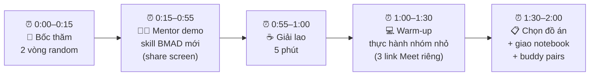
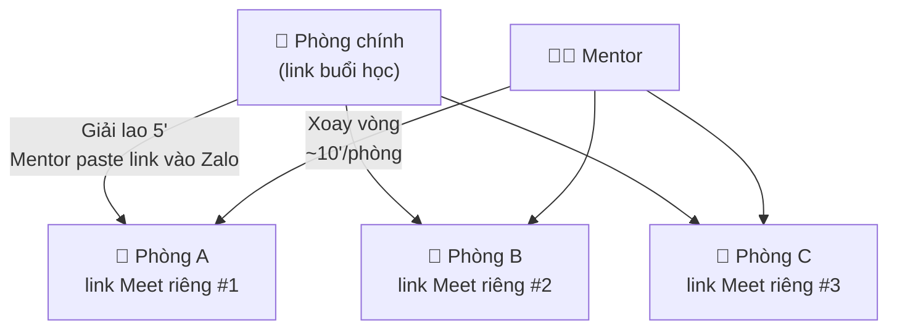
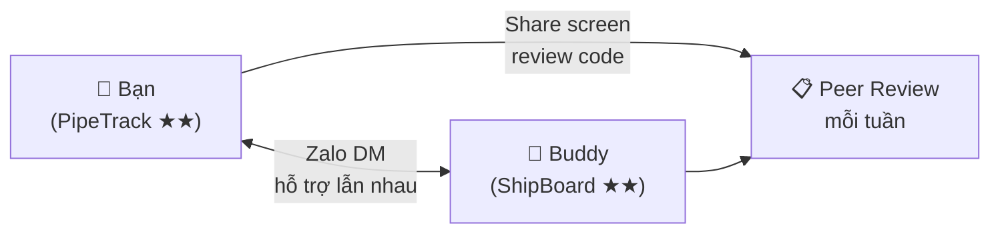
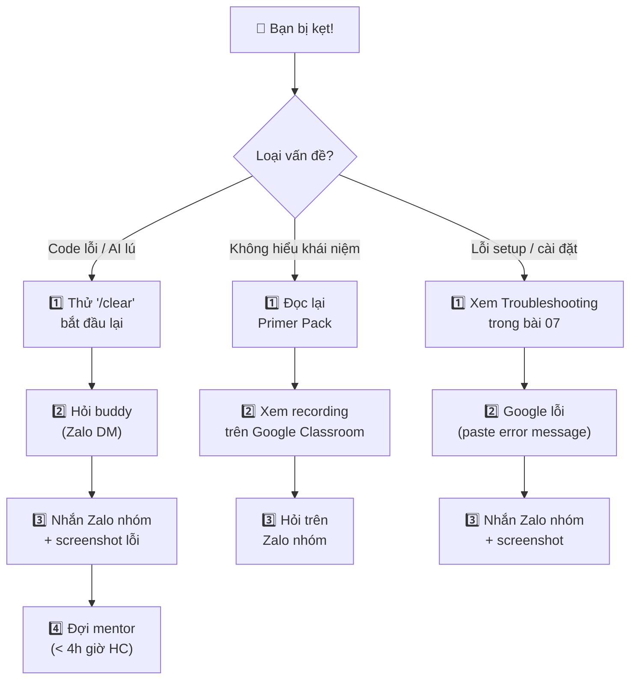

> ⏱️ **Thời lượng:**   
> 🎯 **Mục tiêu:** 

---

## 1. Cấu Trúc Mỗi Buổi Học (2 tiếng)

Mỗi buổi đều có **cùng 1 cấu trúc** — bạn sẽ quen nhanh:



| Phần | Thời gian | Bạn làm gì |
|------|-----------|-------------|
| **Bốc thăm** | 15' | Được gọi tên → giải thích 1 khái niệm cho cả lớp |
| **Mentor demo** | 40' | Xem mentor share screen demo BMAD trên HRIS |
| **Giải lao** | 5' | Tắt camera, uống nước, nghỉ mắt |
| **Warm-up nhóm nhỏ** | 30' | Vào 1 trong 3 link Meet riêng, làm bài tập theo nhóm |
| **Chốt & giao bài** | 30' | Quay về phòng chính, chọn đề + nhận notebook |

---

## 2. Google Meet — Những Thứ Cần Biết

Khoá học dùng **Google Meet** (không phải Zoom). Không cần cài app — chạy thẳng trên Chrome.

### Trước buổi học

- [ ] **Dùng Chrome** (Meet chạy tốt nhất trên Chrome)
- [ ] **Test mic + camera** trước 15 phút: vào https://meet.google.com → New meeting → test
- [ ] **Dùng tai nghe** (headphone) — tránh echo cho cả lớp
- [ ] **Tắt thông báo** trên máy (Focus/DND mode) — tránh lộ tin nhắn riêng khi share screen

### Trong buổi học

| Tính năng | Cách dùng | Khi nào |
|-----------|-----------|---------|
| **Bật/tắt mic** | Click icon mic hoặc `Ctrl+D` (Win) / `Cmd+D` (Mac) | Mute khi không nói |
| **Bật/tắt camera** | Click icon camera hoặc `Ctrl+E` / `Cmd+E` | Bắt buộc 15 phút đầu |
| **Share screen** | Click icon "Present now" → chọn cửa sổ | Khi mentor gọi demo |
| **Reactions** | Click icon 😊 ở thanh dưới | Giơ tay ✋ muốn nói |
| **Chat** | Click icon 💬 ở góc phải | Hỏi nhanh, share link |
| **Đổi tên** | Click avatar → Manage account | Đổi thành "Tên — Đề project" |

> 💡 **Tip:** Đổi tên Google Meet thành format **"Tên — Đề project"** (ví dụ: "Lan — PipeTrack"). Mentor sẽ dễ nhớ bạn đang làm đề gì.

---

## 3. Phòng Nhóm Nhỏ — "3 Link Meet Riêng"

### Tại sao không dùng tính năng Breakout Rooms có sẵn?

Google Meet có tính năng Breakout Rooms nhưng **chỉ hoạt động khi host là tài khoản Google Workspace trả phí**. Để đảm bảo mọi người đều vào được, khoá học dùng cách đơn giản hơn: **3 link Meet riêng tạo sẵn**.

### Cách hoạt động



### Quy trình từng bước

**Cuối phần Giải lao (phút 55–60):**

1. Mentor paste **3 link Meet** vào nhóm Zalo Chat, kèm tên nhóm:
   ```
   Phòng A (Nhóm 1–4): meet.google.com/abc-defg-hij
   Phòng B (Nhóm 5–8): meet.google.com/klm-nopq-rst
   Phòng C (Nhóm 9–12): meet.google.com/uvw-xyza-bcd
   ```
2. Bạn **rời phòng chính** → mở link phòng nhóm của mình → Join
3. Làm bài warm-up trong 30 phút với nhóm

**Cuối phần Warm-up (phút 90):**

4. Mentor gửi tin nhắn Zalo: **"5 phút nữa về phòng chính"**
5. Bạn **rời phòng nhóm** → quay lại link phòng chính ban đầu

### Bạn cần làm gì trong phòng nhóm?

1. **Bật mic + camera** — phòng nhỏ, cần tương tác trực tiếp
2. **Đọc đề bài warm-up** mentor đã post trong Google Classroom (tab Classwork)
3. **Mỗi người share screen** trình bày tiến độ, cả nhóm cùng debug
4. **Không đợi mentor** — hỏi nhau trước, ghi lại câu hỏi chưa giải được

### Cần mentor vào phòng nhóm?

Mentor xoay vòng qua 3 phòng — nếu cần gấp:
- Nhắn **Zalo Chat**: "@mentor Phòng A cần giúp — [mô tả ngắn vấn đề]"
- Mentor sẽ join phòng bạn trong vòng vài phút

> ⚠️ **Đừng ngồi im trong phòng nhóm!** Đây là 30 phút thực hành hiệu quả nhất của buổi. Nếu không làm gì, bạn sẽ không có gì để chốt trong 30 phút cuối.

### Xử lý sự cố thường gặp

| Sự cố | Cách xử lý |
|-------|------------|
| Không tìm thấy link phòng | Mở lại Zalo Chat → kéo lên tìm tin nhắn mentor paste link |
| Vào nhầm phòng | Rời ra, click đúng link phòng của mình |
| Link không vào được | Báo Zalo → mentor tạo link mới trong < 2 phút |
| Mất kết nối giữa chừng | Reconnect và vào lại link phòng nhóm, không cần báo |

---

## 4. Slido — Đặt Câu Hỏi

### Slido là gì?

Slido là ứng dụng Q&A cho phép bạn **đặt câu hỏi ẩn danh** và **vote** câu hỏi hay nhất. Mentor sẽ trả lời câu hỏi có nhiều vote nhất trong phần Q&A cuối buổi.

### Cách dùng

1. Mentor share **link Slido** đầu mỗi buổi (hoặc pin trong Meet chat)
2. Mở link trên trình duyệt hoặc điện thoại
3. Gõ câu hỏi → Submit
4. Vote 👍 câu hỏi người khác bạn cũng muốn biết

> 💡 **Không có câu hỏi ngớ ngẩn.** Nếu bạn thắc mắc, chắc chắn 3–4 người khác cũng thắc mắc. Hỏi đi!

---

## 5. Buddy Pair — "Bạn Đồng Hành"

### Buddy pair là gì?

Mentor sẽ **ghép 2 học viên** thành 1 cặp "buddy" — cùng độ phức tạp đề, cả khoá nhắn tin hỗ trợ nhau qua Zalo.

### Cách hoạt động



### Quy tắc buddy

| Quy tắc | Chi tiết |
|---------|---------|
| **Liên lạc qua Zalo DM** | Nhắn tin trực tiếp cho buddy ngay buổi 1 |
| **Check-in 2 lần/tuần** | "Tuần này mình xong đến step nào rồi?" |
| **Peer review** | Đọc code của buddy, comment ít nhất 2 điểm |
| **Không làm hộ** | Giải thích, gợi ý — KHÔNG code thay |
| **Báo mentor nếu buddy mất tích** | > 3 ngày không reply → nhắn Zalo nhóm cho mentor biết |

> 💡 **Buddy pair là "phao cứu sinh"** cho lúc 2 giờ sáng đang code bị kẹt, mentor chưa online. Buddy có thể share screen Google Meet giúp bạn debug ngay.

---

## 6. Quy Tắc Lớp Học

### Camera

| Thời điểm | Camera |
|-----------|--------|
| 15 phút đầu (bốc thăm) | **BẮT BUỘC bật** |
| Mentor demo | Tuỳ chọn |
| Phòng nhóm nhỏ | **Khuyến khích bật** |
| Chốt & giao bài | Tuỳ chọn |

### Mic

- **Mute** khi không nói (tránh tiếng ồn nền)
- **`Ctrl+D` / `Cmd+D`** để toggle mic nhanh
- Trong phòng nhóm: bật mic tự do, thoải mái nói chuyện

### Giải lao

- **5 phút** giữa phần Demo và Warm-up — mentor đặt timer
- Dùng thời gian này để: uống nước, nghỉ mắt, đi vệ sinh
- **Không skip giải lao** — sau 40 phút demo, não cần reset

### Quy tắc vàng

```
✅ Mentor SẼ gọi tên cụ thể — "Lan, giải thích Git là gì?"
❌ Mentor KHÔNG nói "Ai trả lời đi?" — câu này luôn = im lặng

✅ Được phép nói sai — sai thì sửa, không ai cười
❌ Không được im lặng khi được gọi tên — ít nhất nói "Em chưa hiểu phần này"
```

---

## 7. Ghi Hình Buổi Học

- **Mọi buổi đều được ghi hình** bởi mentor qua Google Meet
- **Upload lên Google Classroom** (tab Stream) trong vòng 24 giờ
- Bạn có thể xem lại nếu bỏ lỡ hoặc muốn ôn

### Quy tắc ghi hình

- Camera bạn **có thể** xuất hiện trong recording
- Nếu không muốn → tắt camera (ngoài 15 phút bắt buộc)
- **Không chia sẻ recording** ra ngoài khoá học

---

## 8. Khi Bị Kẹt — Cầu Cứu Theo Thứ Tự



### Cách đặt câu hỏi hay trên Zalo nhóm

```
❓ Đang làm Story 2 (tạo form đăng ký), bấm Submit thì không lưu vào DB.

Đã thử:
- Chạy lại npm run dev → vẫn lỗi
- /clear + paste lại Story → AI sửa nhưng vẫn lỗi
- Kiểm tra Supabase dashboard → bảng users trống

[screenshot console error]

Đề: PipeTrack (★★)
```

> 💡 **Càng chi tiết → mentor trả lời càng nhanh.** "Em bị lỗi" không đủ — cần screenshot + đã thử gì.

---

## 9. Netiquette — Ứng Xử Online

| ✅ Nên | ❌ Không nên |
|--------|------------|
| Bật camera khi được yêu cầu | Tắt camera suốt buổi |
| Mute khi không nói | Để mic mở có tiếng ồn nền |
| Đặt câu hỏi trên Slido | Im lặng cả buổi |
| Reply buddy trong 24h | Ghost buddy > 3 ngày |
| Nhắn Zalo khi cần hỗ trợ | Chờ đến buổi học mới hỏi |
| Nói "Em chưa hiểu" khi chưa hiểu | Giả vờ hiểu rồi kẹt sau |
| Dùng reactions (👍 ✋ 👏) | Spam chat không liên quan |

---

## ✅ Checklist Trước Buổi 1

- [ ] Google Meet hoạt động trên Chrome (đã test mic + camera)
- [ ] Tai nghe sẵn sàng
- [ ] Đã biết phím tắt mic: `Ctrl+D` (Win) / `Cmd+D` (Mac)
- [ ] Đã join Google Classroom (thấy được tab Classwork)
- [ ] Đã join Zalo nhóm + đổi tên hiển thị "Họ tên — Nhóm A/B/C"
- [ ] Đã hiểu cách dùng 3 link Meet riêng (đọc Section 3)
- [ ] Đã đổi tên hiển thị Google Meet thành "Tên — Đề project"
- [ ] Đã đọc hết 7 bài trước trong Primer Pack

> 🎯 **8/8 ✅ → Bạn sẵn sàng 100%!** Hẹn gặp ở buổi 1! 🚀

---

*📖 Quay lại: [07 — Hướng Dẫn Cài Đặt Công Cụ](./07-tool-setup-guide.md)*  
*🏁 Bạn đã hoàn thành Primer Pack! Quay lại [Mục lục](./index.md) để kiểm tra tiến độ. Hẹn gặp tại buổi 1 — mang theo năng lượng và sẵn sàng Vibe Coding cùng BMAD!*
