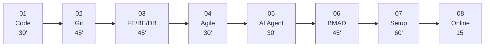

# 🎒 Primer Pack — Chào Mừng Bạn Đến Khoá Vibe Coding!

Xin chào và chúc mừng bạn đã đăng ký khoá **Vibe Coding Thực Chiến Cùng BMAD**! 🎉

Bạn đang cầm trên tay **Primer Pack** — bộ tài liệu nền giúp bạn chuẩn bị kiến thức trước buổi học đầu tiên. Hãy đọc và hoàn thành **tất cả 8 bài** trong ít nhất **5 ngày trước buổi 1**.

> ⚠️ **Buổi 1 sẽ trả bài các kiến thức từ Primer Pack!** Nếu chưa đọc, bạn sẽ khó theo kịp ngay từ đầu.

---

## 📊 Tracker Tiến Độ

Đánh dấu ✅ mỗi bài khi hoàn thành. Tổng thời gian đọc: **~5 giờ 30 phút**.

| # | Bài | Thời lượng | Hoàn thành |
|---|-----|------------|------------|
| 01 | [Code Là Gì?](./01-what-is-code.md) | 30' | ☐ |
| 02 | [Git & GitHub Cơ Bản](./02-git-basics.md) | 45' | ☐ |
| 03 | [Frontend, Backend, Database & API](./03-frontend-backend-db.md) | 45' | ☐ |
| 04 | [Agile & Scrum Cho Người Mới](./04-agile-scrum-101.md) | 30' | ☐ |
| 05 | [AI Agent Là Gì?](./05-ai-agent-concept.md) | 30' | ☐ |
| 06 | [Tổng Quan BMAD Framework](./06-bmad-overview.md) | 45' | ☐ |
| 07 | [Hướng Dẫn Cài Đặt Công Cụ](./07-tool-setup-guide.md) | 60' | ☐ |
| 08 | [Hướng Dẫn Học Online](./08-online-class-guide.md) | 25' | ☐ |

> 🎯 **8/8 ☐ → ✅** = Bạn sẵn sàng 100% cho buổi 1!

---

## 📖 Thứ Tự Đọc

Các bài được sắp xếp theo logic: **nền tảng kỹ thuật → quy trình → công cụ → lớp học**. Hãy đọc theo thứ tự:

**Tips cho từng nhóm học viên:**

- **Nhóm A (Dev):** Có thể đọc nhanh bài 01–03 (đã quen), tập trung vào bài 05–06.
- **Nhóm B (Founder):** Đọc kỹ bài 04 (Agile) và 06 (BMAD) — đây là nền tảng quan trọng nhất.
- **Nhóm C (chưa biết code):** Đọc **tất cả** từ đầu, không skip. Đặc biệt bài 01–03 rất quan trọng.

---

## 🎯 10 Đồ Án — Chọn Đề Trước Buổi 1

Ở buổi 1, bạn sẽ chọn **1 trong 9 đồ án** bên dưới (HRIS dành riêng cho mentor demo). Hãy đọc qua danh sách và **suy nghĩ trước** bạn muốn làm đề nào:

| #   | Tên project       | Nhóm nghề            | Độ phức tạp | Phù hợp                   |
| --- | ----------------- | -------------------- | ----------- | ------------------------- |
| 1   | HireFlow Lite     | HR / Tuyển dụng      | ★★★         | Nhóm B/C có nghiệp vụ HR  |
| 2   | PipeTrack         | Sales / CRM          | ★★          | Nhóm A/B/C — bắt đầu nhẹ  |
| 3   | ShipBoard         | Vận hành / Logistics | ★★          | Nhóm A/B/C — đơn giản     |
| 4   | Content Cal       | Marketing            | ★★★         | Nhóm C — Marketing nội bộ |
| 5   | ExpenseFlow       | Kế toán / Tài chính  | ★★★★        | Nhóm A — thử thách        |
| 6   | MeetRoom          | Hành chính           | ★★          | Nhóm C — Office admin     |
| 7   | TrainTrack        | Đào tạo / L&D        | ★★★         | Nhóm B/C — HR/L&D         |
| 8   | ~~HRIS~~ | ~~Quản lý nhân sự~~  | ~~★★★~~     | **CẤM** — đề mentor demo  |
| 9   | StockRoom         | Kho / Mua hàng       | ★★          | Nhóm C — Admin / Kho      |
| 10  | TaskSprint        | Project Mgmt         | ★★★★        | Nhóm A/B — thử thách      |

Mỗi đề có **playbook riêng** (schema gợi ý, màn hình chính, edge case) — bạn sẽ nhận playbook của đề mình sau khi chọn ở buổi 1. Xem trước playbooks tại thư mục [`playbooks/`](../playbooks/).

**Khuyến nghị:**
- Nhóm A (Dev): ★★★ → ★★★★
- Nhóm B (Founder): ★★ → ★★★
- Nhóm C (chưa biết code): ★★ → ★★★ (tuyệt đối tránh ★★★★)

---

## ❓ Cần Hỗ Trợ?

- **Vướng nội dung Primer Pack:** Nhắn Zalo nhóm kênh `#warmup-help` (hoặc tag `@mentor`)
- **Vướng cài đặt công cụ:** Nhắn Zalo nhóm kèm screenshot lỗi (xem thêm mục Troubleshooting trong bài 07)
- **Câu hỏi chung:** Nhắn trực tiếp mentor qua Zalo hoặc bình luận trong Google Classroom

> 💡 Mentor cam kết trả lời trong < 4 giờ (giờ hành chính).

---

*Chúc bạn đọc vui! Hẹn gặp tại buổi 1 🚀*
